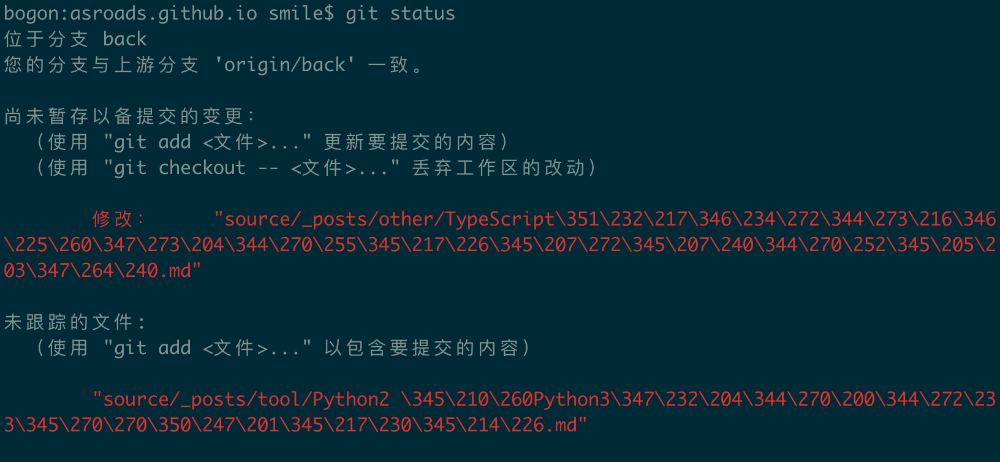
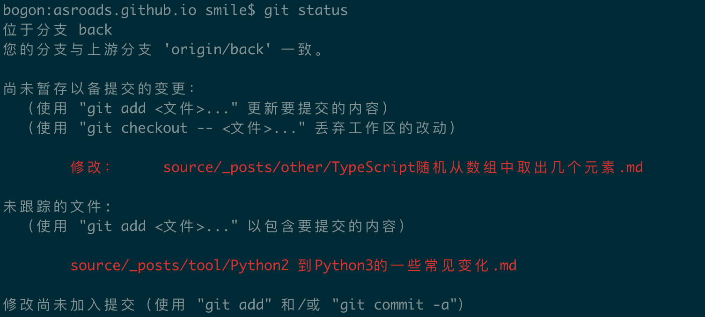

以前在用git的时候 使用 “git status” 的时候 都是正常的，结果最近一次安装之后，发现显示中文的时候是乱码，这个如果是拼音或者英文文件名字还好，遇到中文的就尴尬了，后来网上找到了解决办法：

<!-- more -->

在终端输入 命令 ”git status“  ，显示这样：


原因 ：

在默认设置下，中文文件名在工作区状态输出，中文名不能正确显示，而是显示为八进制的字符编码。

解决办法 
将git 配置文件 `core.quotepath`项设置为false。 quotepath表示引用路径  加上`--global`表示全局配置

终端输入命令：

```bash
git config --global core.quotepath false
```

最后结果如下



完美解决。