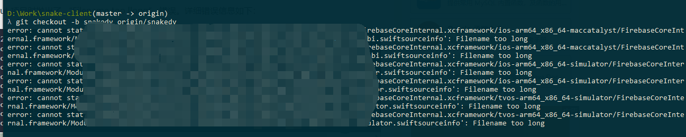

工作的时候，使用windows 更新git项目，切换分支的时候，突然遇到一个错误 `Filename too long 错误`下面记录一下如何解决，以及背后的原因。
<!--more-->
项目导致某些类的文件路径特别长。因此在 Windows 10 下面，使用 git 去 CheckOut 项目时抛出了 “Filename too llong” 错误。详细错误信息如下：



git 可以创建 4096 长度的文件名，然而在 windows 系统中最大文件名长度为 260。这是因为 git 用了旧版本的 windows api。

## 解决方法

### （1）git config 命令方式 

打开 dos 命令行窗口，执行下面 git 命令：

```
git config --global core.longpaths true
```

开启 git 全局支持长路径。

### （2）修改项目 config 配置文件

打开你的项目，找到 .git 隐藏目录，找到“config”配置文件。如下图：


### 拓展知识：

从远程仓库里拉取一条本地不存在的分支时：

```
git checkout -b 本地分支名 origin/远程分支名
```

例如: 切换远程分支

git checkout -b  debug origin/debug100