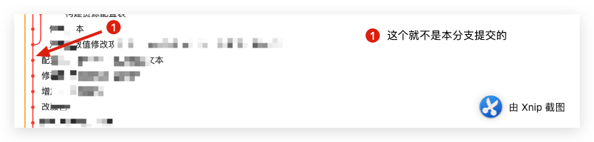

项目开发分支多了有时候需要merge分支，有时候分支会因为某个文件产生冲突，此时可以手动选择解决冲突，也可以使用某个分支多内容作为最新的解决。此时两个分支曾经的修改记录都会合并到一起，有时候想了解某次提交当初是在哪个分支做的，此时需要借助工具查看一下。
<!--more-->

## 如何查看

以前没有特别了解过这些关于git的知识，最近一次合并中遇到了这样的需求，于是就查阅了一番，得出了一些结论：

### SourceTree查看

如果我们使用的是SourceTree

那么某次提交界面如下：


下面这几次提交就是当前分支提交的内容：


### git-fork查看

非本分支提交




当前分支提交


### 使用命令查看

```shell
git branch -r --contains COMMIT_ID
```

```shell
git branch --all --contains COMMIT_ID
```

## 其他拓展：

### git log 的退出

退出：**英文状态下按 q 可以退出git log 状态**。