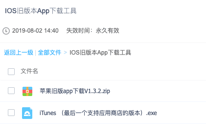
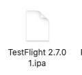
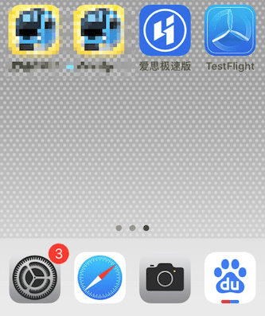
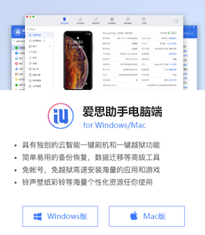
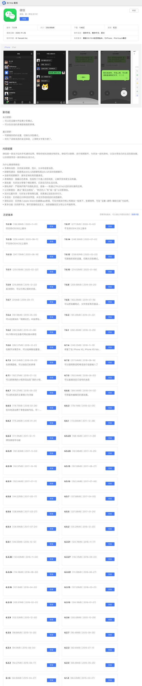

最近在用Cocos Creator原生平台出包，在iOS出包的后，用TestFlight测试，这个TestFlight之前没有用过，觉得麻烦，后面用了之后，觉得真香！前段时间一直用手里的IPod做测试机，后面一次偶然的机会还回去了，就把自己安装的软件卸载（童子军军规），后面再次用来测试的时候，发现TestFlight安装不了，原因是系统版本过低，不支持了，但IPod系统已经是最新版本，无法升级，于是乎，一个安装历史版本的TestFlight的念头油然而生，前几天一直没有找到合适方法，今天终于找到也得以成功，于是记下来！
<!--more-->
iOS不像安卓那样简单可以随意搜到App版本，不少软件只能在App Store下载，安装其实就是简单的三步走：首先找到下载的软件或者配置好下载的环境，然后开始下载操作，后面安装成功后验证可用性。

### 环境以及工具

- Windows环境
- Ipa拦截工具（主要用来拦截下载）
- iTunes 老版本

### 步骤

1. 先去下载安装最后一个可用搜索应用的 iTunes 版本最后一版支持应用商城的iTunes软件

   - 链 接 ：https://pan.baidu.com/s/1lbHCAWkXJuOrwCn51H2-4w

   - 提取码：zzvd

   

2. 下载下来压缩包运行OLDAPP.EXE即可使用，里面附带使用教程.gif，不会可以看

下载地址：https://www.lanzoui.com/b00tw8dud

3. 按照上述操作完成后我们可以得到一个下载好的文件。

4. 最后使用我们的 ITools 安装我们的ipa 文件到Ipod即可！

   

### 其他途径

如果你下载的应用是常见的App 比如 抖音、微信这样的可以用另外一个办法， 下载一个爱思助手

爱思助手官网：https://www.i4.cn/

然后安装成功后搜索自己需要的App

### 总结

这次这个方法解决了很多问题，比如自己的手机系统比较老，手机购买比较早期的，刷机后，无法安装自己喜爱的软件的时候，这个方法还是很好用的！特别是把自己手机转给家人用的，可以试试这个方法，给他们安装特定的版本！当然对于开发者来讲，测试和调试还是很方便的，又get一项技能！

### 参考

- [苹果旧版APP一键下载IOS老版本应用](https://zhuanlan.zhihu.com/p/261004617)
- [IOS旧版本App下载教程](https://www.maxlicheng.com/github/605.html)
- [iPhone 如何安装旧版本的 App？--知乎](https://www.zhihu.com/question/23817667)
- [爱思助手官网](https://www.i4.cn/)

