之前游戏在iOS平台出包还好，一般上传成功后，基本都能正常通过，接下来的就是如何提审等一系列配置。这次遇到了一些问题，于是有了如何对打出的包解包的操作，便于查找。
<!--more-->
此次的问题是由下面的这张图开始的。

### 问题原因

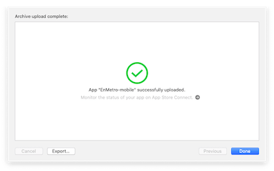

然后我在 https://appstoreconnect.apple.com/apps/ 自己的页面等了好久都没有出现

于是想到了 是不是失败了，于是去查看自己的开发者邮箱，果然如此。

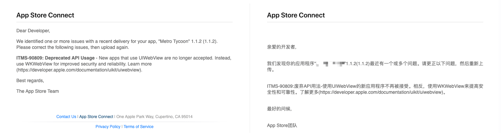

收到一封邮件，内容是 UIWebView 这个类已经废弃，让用最新的 WKWebView来提高安全性和可靠性。

我自己是用Cocos Creator 开发的，于是首相想到了去论坛找问题。

于是找到了这篇文章：

[UIWebView 导致苹果审核被拒，请用 WKWebView 替换。内附升级指导](https://forum.cocos.org/t/uiwebview-wkwebview/93029)

> #### 涉及的引擎版本
>
> 我罗列一下，引擎各产品线更新到 WKWebView 的情况如下：
>
> 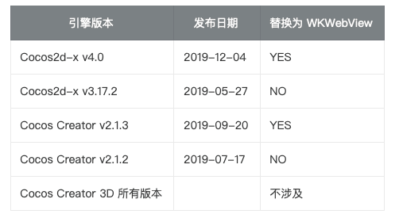
>
> 也就是说，如果你用的是：
>
> - Cocos2d-x v3.17.2 以及更早版本
> - Cocos Creator v2.1.2 以及更早版本
>
> 那么不从引擎里替换掉 UIWebView 调用代码的话，将导致原生包在 AppStore 审核被拒。
>
> Cocos Creator 3D 尚未添加 WebView 支持，所以不涉及。
>
> #### 修改方式
>
> 我不会简单地一句话描述 “请大家升级引擎版本” 来解决。很多开发到中后期、甚至已经上线运营的游戏项目不太可能大动干戈升级整个引擎版本。我们只需要精准地动点儿小手术就行了。
>
> - Cocos2d-x 用户，可以根据 [https://github.com/cocos2d/cocos2d-x/pull/20098/files 219](https://github.com/cocos2d/cocos2d-x/pull/20098/files) 这个 pull request 来做手工合并。
> - Cocos Creator 用户，可以根据 [https://github.com/cocos-creator/cocos2d-x-lite/pull/1837/files 186](https://github.com/cocos-creator/cocos2d-x-lite/pull/1837/files) 这个 pull request 做手工合并。
>
> 虽然 Cocos 引擎团队会持续地升级兼容平台的新接口、新要求，但确实很难把几年前的所有历史版本全部对新接口适配一遍后重新发布，还请大家能够理解。所以正确的解法就是：
>
> 1. 新立项的时候，尽量用最新版的引擎。Dashboard 功能的推出也是为了方便这一点。
> 2. 对于固定在老版本上的已有项目，根据上述 Pull Reuqest 里改动的文件，自己做手工合并。

这样如此看来，目前使用的Cocos Creator 2.4.3版本是不会有这个问题，对官方的这些我还是信任的。

接下来就是查找自己接入的第三方SDK了，如何查找呢，首先是搜索，这个一无所获，因为我接入两个SDK：

#### SDK

- [FaceBook](https://developers.facebook.com/docs/ios)    https://developers.facebook.com/docs/ios
- [ironSource](https://developers.ironsrc.com/ironsource-mobile/ios/ios-sdk/)  https://developers.ironsrc.com/ironsource-mobile/ios/ios-sdk/

这样我需要先找到是谁用了这个过期的才可以和对方对接和交流

于是我找到了一篇文章：

[ITMS-90809: Deprecated API Usage - New apps that use UIWebView are no longer accepted. Instead, use](https://blog.csdn.net/lingjunjie/article/details/106047150)

遗憾的是这个帖看不到图片了，甚是尴尬，于是我再次对这个帖子查找：

[ITMS-90809: Deprecated API Usage - New apps that use UIWebView are no longer accepted. Instead, use](https://www.shangmayuan.com/a/a8b5e3840d59449caf0a6d3f.html)

> ##### iTunesConnect吃包 由于ipa包中包含uiwebview
>
> 5月1号之后iTunesConnect不容许上传的ipa包中屌用UIWebView，使用事后上传的ipa包都不会显示在活动里（我称呼这种骚操做为‘吃包’）。web
>
> 已经把项目工程里面的有关uiwebview的文件都处理好了，从新上传结果仍是不行。在网上看到一个方法可以反编译咱们的ipa包，而后查询ipa中屌用的头文件，这样就能够知道问题出如今哪里了。app
>
> 1. 首先download一个class-dump ： 下载地址：http://stevenygard.com/projects/class-dump/
> 2. 下载ipz文件，解压缩之后直接复制粘贴到 bin文件中，别忘记双击一下class-dump，由于咱们是直接复制粘贴过去的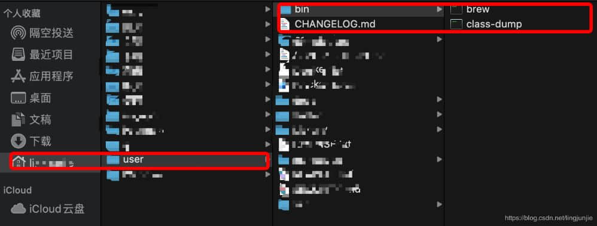3. 这是已经安装好了class-dump ，接下来就是破包。将咱们的ipa包经过ad HOC方式打包出来而后在桌面新建一个文件存放 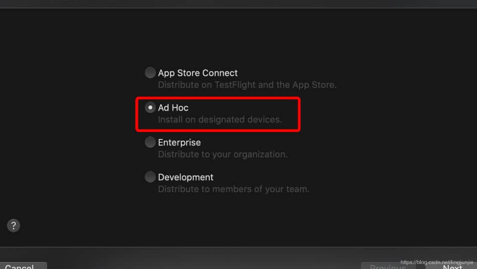
> 3. 接下来咱们把ipa包的后缀改成ipz，而后双击解压一下结果以下：pauload文件下“.app”文件就是咱们要破解的东西
>    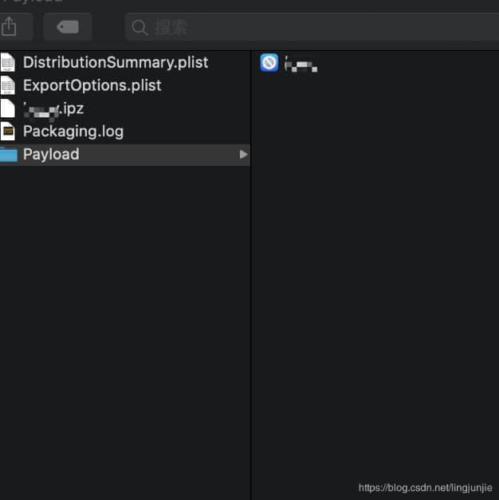
> 4. 打开咱们的终端 而后cd到该文件里面，我使用的zsh。
>    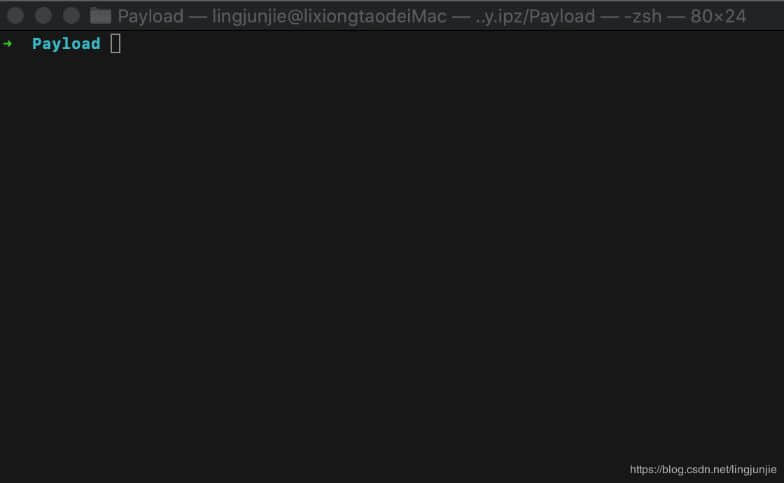
> 5. 看到payload前缀就而后键入class-dump -H ****.app -o ～/Deaktop/result
> 6. 而后就能够到桌面上查看你的result文件 。成功结果截图：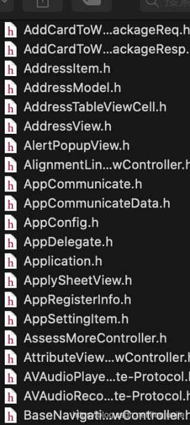
> 7. 接下来把文件夹拖到sunlime Text ，而后按下 command + shift + F 进行全部文件搜索，搜索结果就出来了～
> 8. 完结撒花🎉

这个是完整的，于是我便开始操作。

### 步骤

#### 安装工具class-dump

1. 下载后 解压 复制安装 

http://stevenygard.com/projects/class-dump/
Requires Mac OS X 10.8 or later.

- [class-dump-3.5.dmg](http://stevenygard.com/download/class-dump-3.5.dmg)
- [class-dump-3.5.tar.gz](http://stevenygard.com/download/class-dump-3.5.tar.gz)
- [class-dump-3.5.tar.bz2](http://stevenygard.com/download/class-dump-3.5.tar.bz2)

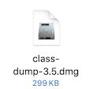

 

2. 将class-dump 复制到/usr/bin/class-dump。如果是OS X 10.11，因没有/usr/bin文件夹的写权限，故将class-dump复制到/usr/local/bin/class-dump即可。

3. 同时打开Terminal，执行命令赋予其执行权限：

   - OS X 10.11之前   sudo chmod 777 /usr/bin/class-dump
   - OS X 10.11之后   sudo chmod 777 /usr/local/bin/class-dump

   后面跟的是自己复制的目录

4. 然后双击运行一下

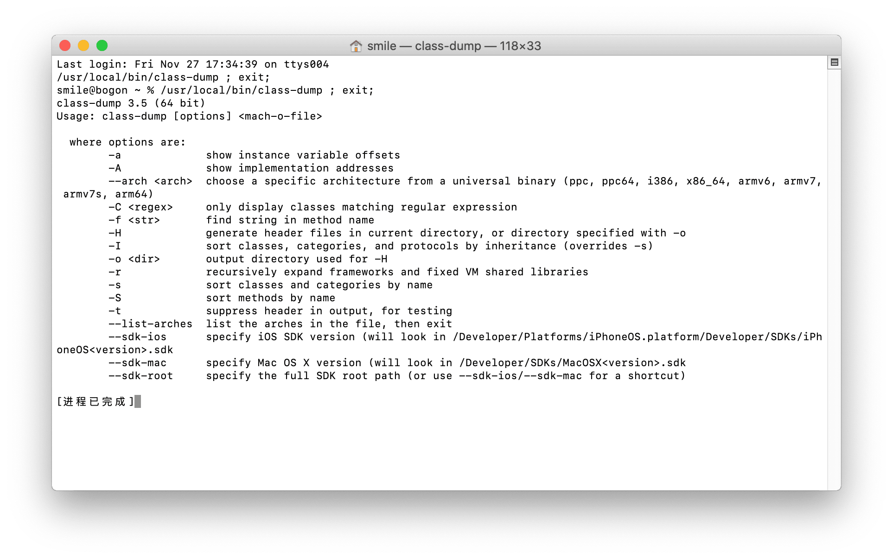

5. 使用class-dump导出头文件的命令格式：class-dump -H 需要导出的框架路径 -o 导出的头文件存放路径

#### 解压ipa包

我这边采用的和上面略有不同，我打出的是 development 包

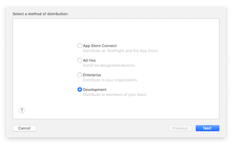

打包完成后 修改 ipa 文件后缀为 ipz

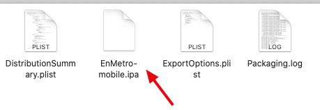

解压文件

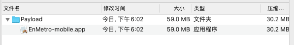

解压后生成这样一个文件

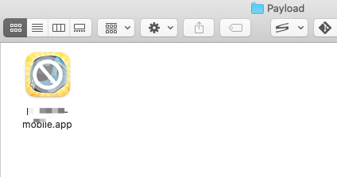

使用命令行工具，切换目录到 Payload 目录 运行命令 ：

```bash
 class-dump -H ****.app -o ～/Deaktop/result
```

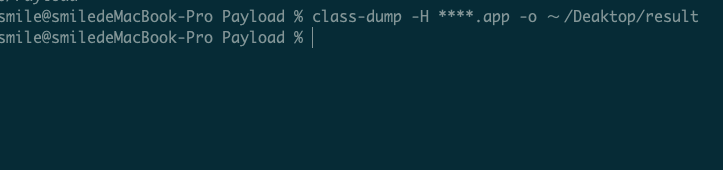

运行成功后在 Payload 目录 生成一个目录 打开文件 夹 用 VSCode 全局搜索  UIWebView  看看 是哪个文件用了。

### 问题解决

其实后面我自己的问题是因为我用pod 安装依赖的时候选择了 早期的版本引起的。

之前我写的是

```
  pod 'FBSDKCoreKit', '8.0.0'
  pod 'IronSourceSDK','6.6.3.1'
```

其实 最新的 IronSourceSDK 是 7.0.3.0

```
  pod 'FBSDKCoreKit', '8.0.0'
  pod 'IronSourceSDK','7.0.3.0'
```

当然这个过程还是蛮坎坷的，不过通过这个问题，又学习了一种技能。

### 其他权限问题

#### ITMS-90683: Missing Purpose String in Info.plist

> Though you are not required to fix the following issues, we wanted to make you aware of them:
>
> **ITMS-90683: Missing Purpose String in Info.plist** - Your app's code references one or more APIs that access sensitive user data. The app's Info.plist file should contain a NSLocationAlwaysUsageDescription key with a user-facing purpose string explaining clearly and completely why your app needs the data. Starting Spring 2019, all apps submitted to the App Store that access user data are required to include a purpose string. If you're using external libraries or SDKs, they may reference APIs that require a purpose string. While your app might not use these APIs, a purpose string is still required. You can contact the developer of the library or SDK and request they release a version of their code that doesn't contain the APIs. Learn more (https://developer.apple.com/documentation/uikit/core_app/protecting_the_user_s_privacy).
>
> **ITMS-90683: Missing Purpose String in Info.plist** - Your app's code references one or more APIs that access sensitive user data. The app's Info.plist file should contain a NSLocationWhenInUseUsageDescription key with a user-facing purpose string explaining clearly and completely why your app needs the data. Starting Spring 2019, all apps submitted to the App Store that access user data are required to include a purpose string. If you're using external libraries or SDKs, they may reference APIs that require a purpose string. While your app might not use these APIs, a purpose string is still required. You can contact the developer of the library or SDK and request they release a version of their code that doesn't contain the APIs. Learn more (https://developer.apple.com/documentation/uikit/core_app/protecting_the_user_s_privacy).


这个说的是 我用了权限 没有在 info.plist 里面说明。

NSLocationAlwaysUsageDescription:用在 **iOS app** 上，用于 **iOS11** 之前，应用在后台时需要获取位置权限说明,需要跟**NSLocationAlwaysAndWhenInUseUsageDescription** 一起添加，**iOS11** 之后，只添加**NSLocationAlwaysAndWhenInUseUsageDescription**就可以了。

NSLocationWhenInUseUsageDescription:用在 **iOS app**上，只能用于应用在前台时需要获取用户位置的权限说明

我们修改添加即可：

```xml
	<key>NSCalendarsUsageDescription</key>
	<string>需要日历权限</string>
	<key>NSCameraUsageDescription</key>
	<string>需要相机权限</string>
	<key>NSLocationAlwaysUsageDescription</key>
	<string>应用在后台时需要获取位置权限</string>
	<key>NSLocationWhenInUseUsageDescription</key>
	<string>需要定位权限</string>
	<key>NSMicrophoneUsageDescription</key>
	<string>录制屏幕需要麦克风权限</string>
	<key>NSPhotoLibraryAddUsageDescription</key>
	<string>需要相册权限</string>
	<key>NSPhotoLibraryUsageDescription</key>
	<string>需要相册权限</string>
```

修改成功后 重新打包，上传成功！！

### 参考文章

- [UIWebView 导致苹果审核被拒，请用 WKWebView 替换。内附升级指导](https://forum.cocos.org/t/uiwebview-wkwebview/93029) --Cocos 论坛

- [iOS-info.plist 中添加定位权限](https://www.jianshu.com/p/71ab6d270c85)
- [Class-dump](http://stevenygard.com/projects/class-dump/) 官网
- [class-dump安装与使用](https://www.cnblogs.com/chars/p/5312644.html)
- [ITMS-90809: Deprecated API Usage - New apps that use UIWebView are no longer accepted. Instead, use](https://blog.csdn.net/lingjunjie/article/details/106047150)--CSDN 原作者
- [ITMS-90809: Deprecated API Usage - New apps that use UIWebView are no longer accepted. Instead, use](https://www.shangmayuan.com/a/a8b5e3840d59449caf0a6d3f.html)--尚码园 转发
- [ironSource](https://developers.ironsrc.com/ironsource-mobile/ios/ios-sdk/)