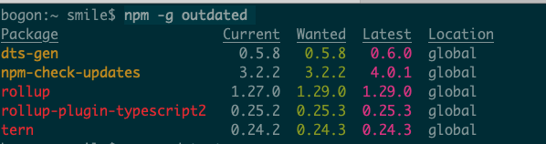
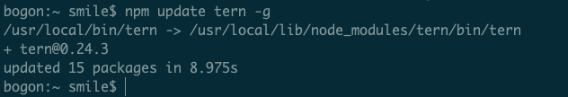
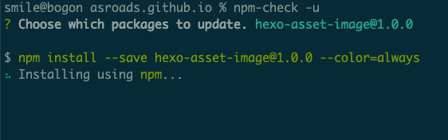
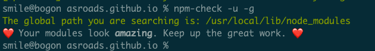
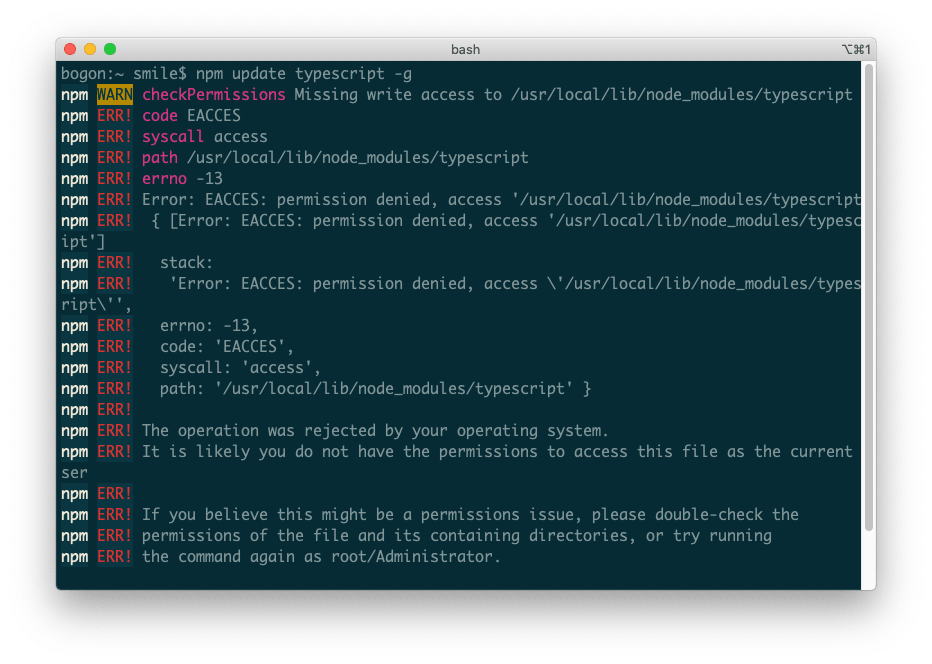
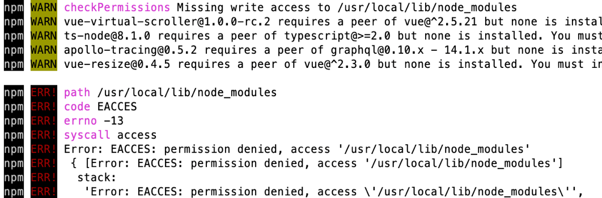

前端开发，避免不了安装npm 有时候依赖的包，升级了，自己用的版本老了，怎么办，肯定是升级，下面就说说如何查找 可以升级的包，怎么升级的。
<!--more-->

### 查找可以升级的包

```
npm -g outdated
```



### 升级某个包

```
npm update <name> -g //<name> 是你要升级的包
```

比如这样 `npm update tern -g`



### 检查 升级

```
sudo npm-check -u -g // 全局
```

```
sudo npm-check -u //当前项目 目录
```

然后 使用 空格键 和 Enter键 操作 升级



最后升级完成 后




### 遇到权限错误

比如 `checkPermissions Missing write access to /usr/local/lib/node_modules/typescript`



```shell
bogon:~ smile$ npm update typescript -g
npm WARN checkPermissions Missing write access to /usr/local/lib/node_modules/typescript
npm ERR! code EACCES
npm ERR! syscall access
npm ERR! path /usr/local/lib/node_modules/typescript
npm ERR! errno -13
npm ERR! Error: EACCES: permission denied, access '/usr/local/lib/node_modules/typescript'
npm ERR!  { [Error: EACCES: permission denied, access '/usr/local/lib/node_modules/typescript']
npm ERR!   stack:
npm ERR!    'Error: EACCES: permission denied, access \'/usr/local/lib/node_modules/typescript\'',
npm ERR!   errno: -13,
npm ERR!   code: 'EACCES',
npm ERR!   syscall: 'access',
npm ERR!   path: '/usr/local/lib/node_modules/typescript' }
npm ERR!
npm ERR! The operation was rejected by your operating system.
npm ERR! It is likely you do not have the permissions to access this file as the current user
npm ERR!
npm ERR! If you believe this might be a permissions issue, please double-check the
npm ERR! permissions of the file and its containing directories, or try running
npm ERR! the command again as root/Administrator.
```

### 解决办法

```shell
sudo chown -R $USER /usr/local/lib/node_modules
```

> The first time you try to install a package globally using [npm](https://flaviocopes.com/npm/), using the syntax `npm install -g ` on a Mac, or Linux, you might get a weird error, saying something like
>
> ```txt
> Missing write access to /usr/local/lib/node_modules
> ```
>
> 
>
> or something along those lines, followed by a long list of other errors of warnings, a consequence of the first error that’s printed to you.
>
> This error is preventing us to install the package.
>
> How do you fix this? It’s a permission error, which means you don’t have write access to that folder.
>
> This is how to solve it. Run this command:
>
> ```sh
> sudo chown -R $USER /usr/local/lib/node_modules
> ```
>
> Let’s break it down:
>
> `sudo` means we are running this command as `root`, the system super user. This is because we don’t have permission to write to that folder, but `root` will be able to fix any permission. This command also means the system will ask for your password to confirm.
>
> `chown` is the command we use to change the owner of a file or folder. We set the `-R` option to change the owner recursively, so we also get owner access to all the files already contained in there.
>
> `$USER` is an environment variable automatically set to your username.
>
> And the final piece is the folder path.
>
> Running this path will make the folder *yours*, so you can safely run your `npm install -g ` commands!
>
> Pay attention to the folder listed by the error message. If it’s different, update the `chown` command accordingly.

参考地址：[How to fix the "Missing write access" error when using npm](https://flaviocopes.com/npm-fix-missing-write-access-error/)

####  npm 升级后 install 报错 

如果遇到 升级后 报错 npm install报错Maximum call stack size exceeded解决办法

```shell
//查看版本
npm -v
 
//更新到最新版本
npm install -g npm
```

删除node_module文件夹和package-lock.json文件，再重新npm install

清空缓存

```shell
npm cache clean --force

npm install
```

#### npm install报错Maximum call stack size exceeded解决办法

```shell
//查看版本
npm -v
 
//更新到最新版本
npm install -g npm
```

删除node_module文件夹和package-lock.json文件，再重新npm install

清空缓存

```shell
npm cache clean --force

npm install
```

