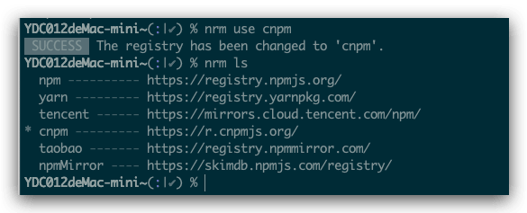

国内开发在使用官方`npm`源的时候有时候某些原因，总是不稳定，有时候需要有npm依赖需要远程下载的时候，总是耽误事，很多时候我们选择国内的`npm`镜像源地址切换，偶尔又想切换回来，这样总是很麻烦，是不是有那么一个插件可以管理这些呢？答案是肯定的，于是今天介绍的主角[nrm](https://github.com/Pana/nrm)（`NPM Registry Manager`）`NPM` 注册源管理器闪亮登场。
<!--more-->

## 以往的做法

```shell
# 查看当前 npm 源地址
npm config get registry
# 若不是，重新设置 npm 源地址
npm config set registry https://registry.npmjs.org/
```

比如需要切换到淘宝镜像

```shell
npm config set registry https://registry.npmmirror.com
```

## NRM管理方式

### NRM的出现原因

由于 `NPM` 官方默认的包注册源位于国外，直接从该源下载包可能速度较慢，许多开发者会选择使用如淘宝 NPM 镜像这样的国内镜像源。[nrm](https://github.com/Pana/nrm) 就是用来帮助用户在不同镜像源之间快速切换的工具。

### nrm作用

`nrm`主要用来便捷地管理和切换不同的 `NPM` (`Node Package Manager`) 包注册源，这对于提高依赖包的下载速度非常有用，特别是对于那些在中国或其他国际网络访问受限地区的开发者。

### nrm如何使用 

1. **安装`nrm`**：在命令行中运行以下命令来全局安装 `nrm`：

```shell
npm install -g nrm
```


2. **列出可用的 `NPM` 源**：安装完成后，可以通过以下命令查看已知的 `NPM` 源列表：

```shell
nrm ls
```

```shell
$ nrm ls
* npm ---------- https://registry.npmjs.org/
  yarn --------- https://registry.yarnpkg.com/
  tencent ------ https://mirrors.cloud.tencent.com/npm/
  cnpm --------- https://r.cnpmjs.org/
  taobao ------- https://registry.npmmirror.com/
  npmMirror ---- https://skimdb.npmjs.com/registry/
```

3. **使用 `nrm` 切换源**：若要切换至某个特定的 `NPM` 源，例如切换至淘宝 `NPM` 镜像：

```shell
nrm use taobao
```



4. **添加自定义源**：如果你需要添加或移除自定义的 `NPM` 源，可以使用相应的 `add` 和 `del` 命令。

   - **添加源**

     ```shell
     nrm add <registry>
     ```

   -  **删除源**

     ```shell
     nrm del <registry>
     ```

5. **设置默认源**：若要设置某个源为默认源，可以先切换至该源，`nrm` 会自动将其设为默认：

```shell
nrm default <registry-name>
```

6. **测试源的速度**：可以通过以下命令测试各个源的下载速度：

```shell
nrm test
```


注意：其中，`registry`为源名，通过这些基本操作，开发人员可以轻松应对不同场景下的 `NPM` 源需求，从而提高开发效率。

## 参考

- [NPM registry manager](https://github.com/Pana/nrm)