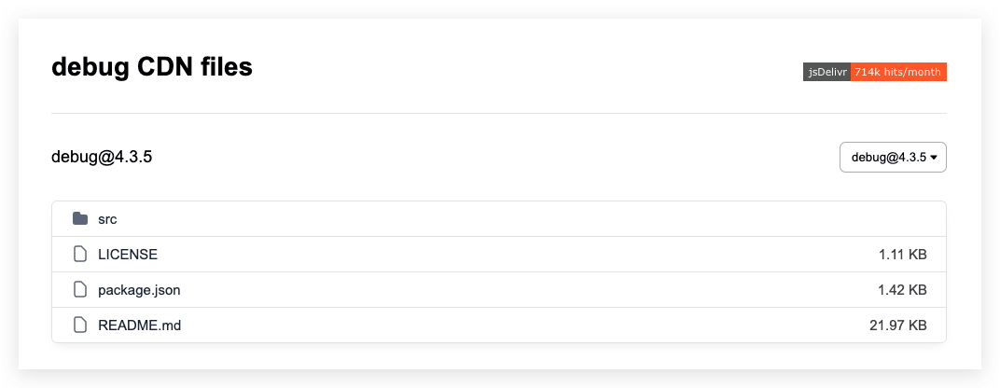
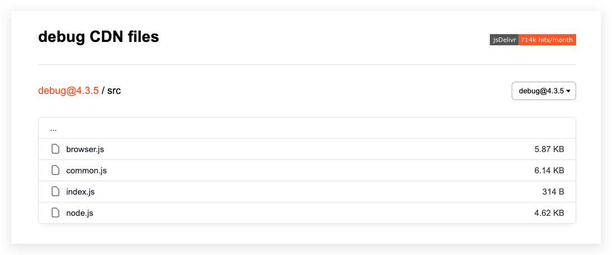
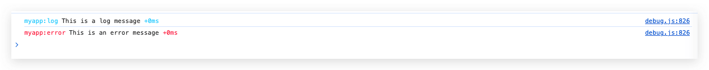
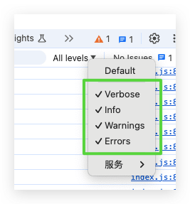

`debug` 库是一个用于调试 `node.js` 和浏览器端 `JavaScript` 应用程序的工具，它允许你通过命名空间管理和显示调试信息目前 `debug` 的最新版本是 4.3.5，发布于 2024 年 5 月 31 日。

<!--more-->

先看看效果：


## 环境

- [ms](https://github.com/vercel/ms)
- [debug](https://github.com/debug-js/debug)

### 安装

```shell
npm install debug
```

安装声明文件 [debug.d.ts](https://github.com/DefinitelyTyped/DefinitelyTyped/tree/master/types/debug)

```shell
npm install --save @types/debug
```

**引入库**

在你的 JavaScript 文件中引入 `debug` 库：

```javascript
const debug = require('debug');
```

**创建命名空间**

使用 `debug` 创建一个命名空间。这有助于你分类和过滤调试信息：

```javascript
const log = debug('myapp:log');
const error = debug('myapp:error');
```

**输出调试信息**

使用命名空间输出调试信息：

```javascript
log('This is a log message');
error('This is an error message');
```

`debug.d.ts`

```typescript
declare var debug: debug.Debug & { debug: debug.Debug; default: debug.Debug };

export = debug;
export as namespace debug;

declare namespace debug {
    interface Debug {
        (namespace: string): Debugger;
        coerce: (val: any) => any;
        disable: () => string;
        enable: (namespaces: string) => void;
        enabled: (namespaces: string) => boolean;
        formatArgs: (this: Debugger, args: any[]) => void;
        log: (...args: any[]) => any;
        selectColor: (namespace: string) => string | number;
        humanize: typeof import("ms");

        names: RegExp[];
        skips: RegExp[];

        formatters: Formatters;

        inspectOpts?: {
            hideDate?: boolean | number | null;
            colors?: boolean | number | null;
            depth?: boolean | number | null;
            showHidden?: boolean | number | null;
        };
    }

    type IDebug = Debug;

    interface Formatters {
        [formatter: string]: (v: any) => string;
    }

    type IDebugger = Debugger;

    interface Debugger {
        (formatter: any, ...args: any[]): void;

        color: string;
        diff: number;
        enabled: boolean;
        log: (...args: any[]) => any;
        namespace: string;
        destroy: () => boolean;
        extend: (namespace: string, delimiter?: string) => Debugger;
    }
}
```

`ms.d.ts`

```typescript
/**
 * Short/Long format for `value`.
 *
 * @param {Number} value
 * @param {{long: boolean}} options
 * @return {String}
 */
declare function ms(value: number, options?: { long: boolean }): string;

/**
 * Parse the given `value` and return milliseconds.
 *
 * @param {String} value
 * @return {Number}
 */
declare function ms(value: string): number;

export = ms;
```

### 使用CDN 服务提供商文件

[jsDelivr](https://www.jsdelivr.com/) 是一个快速的开源 CDN，可以托管各种 `JavaScript` 库。

要找到 `debug` 库的 URL，可以按照以下步骤进行：

- 访问 [jsDelivr](https://www.jsdelivr.com/) 网站。
- 在搜索框中输入 `debug` 并搜索。
- 选择你需要的版本并复制相应的 URL。例如：`https://cdn.jsdelivr.net/npm/debug/dist/debug.js`

地址：https://cdn.jsdelivr.net/npm/debug@4.3.5/





## 测试例子

浏览器环境使用，这里写一个`web`版本 ，`node.js`版本

### web 版本

**引入库**

可以通过 `<script>` 标签引入 `debug` 库：

```html
<script src="path/to/debug.js"></script>
```

**使用命名空间**

和 Node.js 中一样，你可以创建命名空间并输出调试信息：

```javascript
const log = debug('myapp:log');
const error = debug('myapp:error');

log('This is a log message');
error('This is an error message');
```

**启用调试**

在浏览器的控制台中设置 `localStorage` 来启用调试：

```javascript
localStorage.setItem('debug', 'myapp:*');
```

然后刷新页面，调试信息就会在控制台中显示。


```html
<!DOCTYPE html>
<html lang="en">
<head>
    <meta charset="UTF-8">
    <title>Debug Demo</title>
    <script src="https://cdn.jsdelivr.net/npm/debug/dist/debug.js"></script>
    <script>
        // 启用调试
        localStorage.setItem('debug', 'myapp:*');

        // 创建命名空间
        const log = debug('myapp:log');
        const error = debug('myapp:error');

        // 输出调试信息
        log('This is a log message');
        error('This is an error message');
    </script>
</head>
<body>
</body>
</html>
```

显示效果：



以下是一个完整的示例，展示如何在 `Node.js` 应用程序中使用 `debug` 库：

```javascript
// 引入 debug 库
const debug = require('debug');

// 创建命名空间
const log = debug('myapp:log');
const error = debug('myapp:error');

// 启用调试
debug.enable('myapp:*');

// 输出调试信息
log('This is a log message');
error('This is an error message');

// 你可以在应用程序的其他地方继续使用这些命名空间
function someFunction() {
  log('someFunction was called');
}

someFunction();

```

在运行这个示例时，你会在控制台看到类似如下的输出：

```shell
myapp:log This is a log message +0ms
myapp:error This is an error message +1ms
myapp:log someFunction was called +0ms
```

## 使用 Webpack编译Typescript例子

`debug` 库支持 TypeScript 和 `import` 语法。你可以在 TypeScript 项目中使用它，并获得类型检查和代码补全等好处。以下是如何在 TypeScript 项目中使用 `debug` 库的步骤：

是的，`debug` 库支持 TypeScript 和 `import` 语法。你可以在 TypeScript 项目中使用它，并获得类型检查和代码补全等好处。以下是如何在 `TypeScript` 项目中使用 `debug` 库的步骤：

#### 1. 安装 `debug` 和类型定义

首先，安装 `debug` 库和它的类型定义：

```sh
npm install debug
npm install --save-dev @types/debug
```

#### 2. 在 TypeScript 文件中导入并使用

在你的 TypeScript 文件中，你可以使用 `import` 语法导入 `debug`：

```ts
// src/index.ts

import debug from 'debug';

// 启用调试
localStorage.setItem('debug', 'myapp:*');

// 创建命名空间
const log = debug('myapp:log');
const error = debug('myapp:error');

// 输出调试信息
log('This is a log message');
error('This is an error message');
```

#### 3. 配置 TypeScript 编译器

确保你的 `tsconfig.json` 配置文件正确设置，以便 TypeScript 能正确编译你的代码：

```json
{
  "compilerOptions": {
    "target": "ES5",
    "module": "ESNext",
    "strict": true,
    "esModuleInterop": true,
    "skipLibCheck": true,
    "forceConsistentCasingInFileNames": true,
    "outDir": "./dist"
  },
  "include": ["src/**/*"],
  "exclude": ["node_modules", "**/*.spec.ts"]
}
```

#### 4. 使用 Webpack 或其他构建工具打包

如果使用 Webpack 或其他构建工具来打包你的 TypeScript 代码，确保它们正确配置以处理 TypeScript 文件。

#### Webpack 示例配置

1. 安装 Webpack 和相关依赖：

   ```sh
   npm install --save-dev webpack webpack-cli ts-loader
   ```

2. 创建 Webpack 配置文件 `webpack.config.js`：

   ```js
   const path = require('path');

   module.exports = {
       entry: './src/index.ts',
       module: {
           rules: [
               {
                   test: /\.ts$/,
                   use: 'ts-loader',
                   exclude: /node_modules/
               }
           ]
       },
       resolve: {
           extensions: ['.ts', '.js']
       },
       output: {
           filename: 'bundle.js',
           path: path.resolve(__dirname, 'dist')
       },
       mode: 'development'
   };
   ```

3. 创建 TypeScript 配置文件 `tsconfig.json`（如果还没有）：

   ```json
   {
     "compilerOptions": {
       "target": "ES5",
       "module": "ESNext",
       "strict": true,
       "esModuleInterop": true,
       "skipLibCheck": true,
       "forceConsistentCasingInFileNames": true,
       "outDir": "./dist"
     },
     "include": ["src/**/*"],
     "exclude": ["node_modules", "**/*.spec.ts"]
   }
   ```

4. 在 `src/index.ts` 中编写代码（如上所示）。

5. 运行 Webpack 构建：

   ```shell
   npx webpack
   ```

6. 在 HTML 文件中引入打包后的文件：

   ```html
   <!DOCTYPE html>
   <html lang="en">
   <head>
       <meta charset="UTF-8">
       <title>Debug Demo</title>
       <script>
           // 启用调试
           localStorage.setItem('debug', 'myapp:*');
       </script>
       <script src="./dist/bundle.js"></script>
   </head>
   <body>
   </body>
   </html>
   ```

通过这些步骤，你可以在 TypeScript 项目中使用 `debug` 库。

## 如何在Cocos Creator项目使用

### CocosCreator例子

```typescript
import debug  from './libs/debugmin/debug';
// 创建命名空间
const log = debug('myapp:log');
const error = debug('myapp:error');
const dc = debug('myapp:dc');
const { ccclass, property } = cc._decorator;

@ccclass
export default class HelloTest extends cc.Component {
    protected onLoad() {

        // // 启用调试
        localStorage.setItem('debug', '*');

        // localStorage.setItem('debug', 'myapp:*');
        // 检查 localStorage 是否正确设置
        console.log('localStorage debug setting:', localStorage.getItem('debug'));

        // // 创建命名空间
        // const log = debug('myapp:log');
        // const error = debug('myapp:error');

        // 输出调试信息
        log('This is a log message');
        error('This is an error message');
    }

    protected start() {
        this.onTouchSubStart();
        this.onTouchAddStart();
        this.onTouchSubEnd();
    }

    private onTouchSubStart(event?: cc.Event.EventTouch) {
        console.log("onTouchSubStart");
    }

    private onTouchSubEnd(event?: cc.Event.EventTouch) {
        log("onTouchSubEnd");
    }

    private onTouchAddStart(event?: cc.Event.EventTouch) {
        dc("onTouchAddStart");
    }
}

```

 展示效果：


## 注意事项

####  启用调试

具体来说：

```javascript
localStorage.setItem('debug', 'myapp:*');
```

`localStorage` 方法接受两个参数：第一个是键名，第二个是要存储的值。

在这个例子中：

- **键名**: `'debug'` 这个键名是 `debug` 库用来读取调试设置的。
- **值**: `'myapp:*'` 这个值指定了哪些命名空间的日志信息应该显示。

`'myapp:*'` 表示所有以 `'myapp:'` 开头的命名空间都会启用调试输出。`*` 是一个通配符，表示匹配所有后续字符。例如，如果你有以下命名空间：

- `myapp:log`
- `myapp:error`
- `myapp:info`

它们都会被启用，显示相应的调试信息。

你可以用不同的方式配置调试输出，例如：

- `'myapp:log'` 只启用 `myapp:log` 命名空间的调试信息。
- `'myapp:error,myapp:info'` 启用 `myapp:error` 和 `myapp:info` 命名空间的调试信息。
- `'*'` 启用所有命名空间的调试信息。

通过设置 `localStorage` 中的 `debug` 键，你可以控制在浏览器中哪些调试信息会被显示。`debug` 库会在启动时检查这个设置，并相应地启用或禁用不同命名空间的日志输出。

#### 日志展示

展示日志的时候 需要勾选对应的level debug.js 默认使用的是 console.debug 而不是console.log。



源码如下：


如果不想每次都勾选 可以自己修改源码 比如 ：

```javascript
exports.log = console.log || console.debug (() => {});
```

## 拓展功能

### 增加函数运行时间的装饰器

我们合并上面的`common.js`和`browser.js` 新名字叫做 `debug.js` 然后末尾追加下面代码 [CDN文件](https://cdn.jsdelivr.net/npm/debug/dist/debug.js)

```javascript
// 定义 logCost 装饰器
function logCost(target, name, descriptor) {
    const original = descriptor && descriptor.value;
    if (typeof original === "function") {
        descriptor.value = function (...args) {
            const start = typeof performance !== 'undefined' ? performance.now() : Date.now();

            try {
                const result = original.apply(this, args);

                // 处理同步方法
                if (result && typeof result.then === "function") {
                    return result.then((res) => {
                        const end = typeof performance !== 'undefined' ? performance.now() : Date.now();
                        log(`🥰:${name} ${(end - start).toFixed(2)}ms`);
                        return res;
                    }).catch((err) => {
                        const end = typeof performance !== 'undefined' ? performance.now() : Date.now();
                        log(`🥰:${name} ${(end - start).toFixed(2)}ms`);
                        throw err;
                    });
                } else {
                    const end = typeof performance !== 'undefined' ? performance.now() : Date.now();
                    log(`🥰:${name} ${(end - start).toFixed(2)}ms`);
                    return result;
                }
            } catch (e) {
                const end = typeof performance !== 'undefined' ? performance.now() : Date.now();
                log(`🥰:${name} ${(end - start).toFixed(2)}ms`);
                throw e;
            }
        };
    }
    return descriptor;
}

// 导出 logCost 装饰器
module.exports.logCost = logCost;
```

对应的声明文件

```typescript
type MethodDecorator = <T>(
    target: Object | Function,
    propertyKey: string | symbol,
    descriptor: TypedPropertyDescriptor<T>
) => TypedPropertyDescriptor<T> | void;

export const logCost: MethodDecorator; // Added logCost decorator
```

### 如何使用

```typescript
import debug,{ logCost }  from './libs/debugmin/debug';
// 创建命名空间
const log = debug('myapp:log');
const {ccclass, property} = cc._decorator;
@ccclass
export default class HelloTest extends cc.Component {
    protected onLoad() {
        // // 启用调试
        localStorage.setItem('debug', '*');

        // localStorage.setItem('debug', 'myapp:*');
        // 检查 localStorage 是否正确设置
        console.log('localStorage debug setting:', localStorage.getItem('debug'));
    }

    protected start() {
        this.onTouchSubEnd();
    }
    @logCost
    private onTouchSubEnd(event?: cc.Event.EventTouch) {
        log("onTouchSubEnd");
    }
}
```

### 显示效果


### 完整代码 debug.js

```javascript
function setup(e) {
    function n(e) {
        let r, s, o, l = null;

        function a(...e) {
            if (!a.enabled) return;
            const t = a, s = Number(new Date), o = s - (r || s);
            t.diff = o, t.prev = r, t.curr = s, r = s, e[0] = n.coerce(e[0]), "string" != typeof e[0] && e.unshift("%O");
            let l = 0;
            e[0] = e[0].replace(/%([a-zA-Z%])/g, ((r, s) => {
                if ("%%" === r) return "%";
                l++;
                const o = n.formatters[s];
                if ("function" == typeof o) {
                    const n = e[l];
                    r = o.call(t, n), e.splice(l, 1), l--
                }
                return r
            })), n.formatArgs.call(t, e);
            (t.log || n.log).apply(t, e)
        }

        return a.namespace = e, a.useColors = n.useColors(), a.color = n.selectColor(e), a.extend = t, a.destroy = n.destroy, Object.defineProperty(a, "enabled", {
            enumerable: !0,
            configurable: !1,
            get: () => null !== l ? l : (s !== n.namespaces && (s = n.namespaces, o = n.enabled(e)), o),
            set: e => {
                l = e
            }
        }), "function" == typeof n.init && n.init(a), a
    }

    function t(e, t) {
        const r = n(this.namespace + (void 0 === t ? ":" : t) + e);
        return r.log = this.log, r
    }

    function r(e) {
        return e.toString().substring(2, e.toString().length - 2).replace(/\.\*\?$/, "*")
    }

    return n.debug = n, n.default = n, n.coerce = function (e) {
        if (e instanceof Error) return e.stack || e.message;
        return e
    }, n.disable = function () {
        const e = [...n.names.map(r), ...n.skips.map(r).map((e => "-" + e))].join(",");
        return n.enable(""), e
    }, n.enable = function (e) {
        let t;
        n.save(e), n.namespaces = e, n.names = [], n.skips = [];
        const r = ("string" == typeof e ? e : "").split(/[\s,]+/), s = r.length;
        for (t = 0; t < s; t++) r[t] && ("-" === (e = r[t].replace(/\*/g, ".*?"))[0] ? n.skips.push(new RegExp("^" + e.slice(1) + "$")) : n.names.push(new RegExp("^" + e + "$")))
    }, n.enabled = function (e) {
        if ("*" === e[e.length - 1]) return !0;
        let t, r;
        for (t = 0, r = n.skips.length; t < r; t++) if (n.skips[t].test(e)) return !1;
        for (t = 0, r = n.names.length; t < r; t++) if (n.names[t].test(e)) return !0;
        return !1
    }, n.humanize = require("ms"), n.destroy = function () {
        console.warn("Instance method `debug.destroy()` is deprecated and no longer does anything. It will be removed in the next major version of `debug`.")
    }, Object.keys(e).forEach((t => {
        n[t] = e[t]
    })), n.names = [], n.skips = [], n.formatters = {}, n.selectColor = function (e) {
        let t = 0;
        for (let n = 0; n < e.length; n++) t = (t << 5) - t + e.charCodeAt(n), t |= 0;
        return n.colors[Math.abs(t) % n.colors.length]
    }, n.enable(n.load()), n
}

module.exports = setup;

function useColors() {
    return !("undefined" == typeof window || !window.process || "renderer" !== window.process.type && !window.process.__nwjs) || ("undefined" == typeof navigator || !navigator.userAgent || !navigator.userAgent.toLowerCase().match(/(edge|trident)\/(\d+)/)) && ("undefined" != typeof document && document.documentElement && document.documentElement.style && document.documentElement.style.WebkitAppearance || "undefined" != typeof window && window.console && (window.console.firebug || window.console.exception && window.console.table) || "undefined" != typeof navigator && navigator.userAgent && navigator.userAgent.toLowerCase().match(/firefox\/(\d+)/) && parseInt(RegExp.$1, 10) >= 31 || "undefined" != typeof navigator && navigator.userAgent && navigator.userAgent.toLowerCase().match(/applewebkit\/(\d+)/))
}

function formatArgs(e) {
    if (e[0] = (this.useColors ? "%c" : "") + this.namespace + (this.useColors ? " %c" : " ") + e[0] + (this.useColors ? "%c " : " ") + "+" + module.exports.humanize(this.diff), !this.useColors) return;
    const o = "color: " + this.color;
    e.splice(1, 0, o, "color: inherit");
    let t = 0, C = 0;
    e[0].replace(/%[a-zA-Z%]/g, (e => {
        "%%" !== e && (t++, "%c" === e && (C = t))
    })), e.splice(C, 0, o)
}

function save(e) {
    try {
        e ? exports.storage.setItem("debug", e) : exports.storage.removeItem("debug")
    } catch (e) {
    }
}

function load() {
    let e;
    try {
        e = exports.storage.getItem("debug")
    } catch (e) {
    }
    return !e && "undefined" != typeof process && "env" in process && (e = process.env.DEBUG), e
}

function localstorage() {
    try {
        return localStorage
    } catch (e) {
    }
}

exports.formatArgs = formatArgs, exports.save = save, exports.load = load, exports.useColors = useColors, exports.storage = localstorage(), exports.destroy = (() => {
    let e = !1;
    return () => {
        e || (e = !0, console.warn("Instance method `debug.destroy()` is deprecated and no longer does anything. It will be removed in the next major version of `debug`."))
    }
})(), exports.colors = ["#0000CC", "#0000FF", "#0033CC", "#0033FF", "#0066CC", "#0066FF", "#0099CC", "#0099FF", "#00CC00", "#00CC33", "#00CC66", "#00CC99", "#00CCCC", "#00CCFF", "#3300CC", "#3300FF", "#3333CC", "#3333FF", "#3366CC", "#3366FF", "#3399CC", "#3399FF", "#33CC00", "#33CC33", "#33CC66", "#33CC99", "#33CCCC", "#33CCFF", "#6600CC", "#6600FF", "#6633CC", "#6633FF", "#66CC00", "#66CC33", "#9900CC", "#9900FF", "#9933CC", "#9933FF", "#99CC00", "#99CC33", "#CC0000", "#CC0033", "#CC0066", "#CC0099", "#CC00CC", "#CC00FF", "#CC3300", "#CC3333", "#CC3366", "#CC3399", "#CC33CC", "#CC33FF", "#CC6600", "#CC6633", "#CC9900", "#CC9933", "#CCCC00", "#CCCC33", "#FF0000", "#FF0033", "#FF0066", "#FF0099", "#FF00CC", "#FF00FF", "#FF3300", "#FF3333", "#FF3366", "#FF3399", "#FF33CC", "#FF33FF", "#FF6600", "#FF6633", "#FF9900", "#FF9933", "#FFCC00", "#FFCC33"], exports.log = console.log || console.debug || console.log || (() => {
}), module.exports = setup(exports);
const {formatters: formatters,log:log} = module.exports;

// 将 common.js 的逻辑合并到这里
function init(debug) {
    // common.js 的 init 函数内容
}

function coerce(val) {
    // common.js 的 coerce 函数内容
}

exports.init = init;
exports.coerce = coerce;

exports.formatters = {
    // 根据你的需求添加或调整 formatters 的内容
    j: function (v) {
        try {
            return JSON.stringify(v);
        } catch (error) {
            return '[UnexpectedJSONParseError]: ' + error.message;
        }
    }
};

// 定义 logCost 装饰器
function logCost(target, name, descriptor) {
    const original = descriptor && descriptor.value;
    if (typeof original === "function") {
        descriptor.value = function (...args) {
            const start = typeof performance !== 'undefined' ? performance.now() : Date.now();

            try {
                const result = original.apply(this, args);

                // 处理同步方法
                if (result && typeof result.then === "function") {
                    return result.then((res) => {
                        const end = typeof performance !== 'undefined' ? performance.now() : Date.now();
                        log(`🥰:${name} ${(end - start).toFixed(2)}ms`);
                        return res;
                    }).catch((err) => {
                        const end = typeof performance !== 'undefined' ? performance.now() : Date.now();
                        log(`🥰:${name} ${(end - start).toFixed(2)}ms`);
                        throw err;
                    });
                } else {
                    const end = typeof performance !== 'undefined' ? performance.now() : Date.now();
                    log(`🥰:${name} ${(end - start).toFixed(2)}ms`);
                    return result;
                }
            } catch (e) {
                const end = typeof performance !== 'undefined' ? performance.now() : Date.now();
                log(`🥰:${name} ${(end - start).toFixed(2)}ms`);
                throw e;
            }
        };
    }
    return descriptor;
}

// 导出 logCost 装饰器
module.exports.logCost = logCost;
```

### 压缩后完整代码 debug.min.js

```javascript
function setup(e){function n(e){let r,s,o,l=null;function a(...e){if(!a.enabled)return;const t=a,s=Number(new Date),o=s-(r||s);t.diff=o,t.prev=r,t.curr=s,r=s,e[0]=n.coerce(e[0]),"string"!=typeof e[0]&&e.unshift("%O");let l=0;e[0]=e[0].replace(/%([a-zA-Z%])/g,((r,s)=>{if("%%"===r)return"%";l++;const o=n.formatters[s];if("function"==typeof o){const n=e[l];r=o.call(t,n),e.splice(l,1),l--}return r})),n.formatArgs.call(t,e);(t.log||n.log).apply(t,e)}return a.namespace=e,a.useColors=n.useColors(),a.color=n.selectColor(e),a.extend=t,a.destroy=n.destroy,Object.defineProperty(a,"enabled",{enumerable:!0,configurable:!1,get:()=>null!==l?l:(s!==n.namespaces&&(s=n.namespaces,o=n.enabled(e)),o),set:e=>{l=e}}),"function"==typeof n.init&&n.init(a),a}function t(e,t){const r=n(this.namespace+(void 0===t?":":t)+e);return r.log=this.log,r}function r(e){return e.toString().substring(2,e.toString().length-2).replace(/\.\*\?$/,"*")}return n.debug=n,n.default=n,n.coerce=function(e){if(e instanceof Error)return e.stack||e.message;return e},n.disable=function(){const e=[...n.names.map(r),...n.skips.map(r).map((e=>"-"+e))].join(",");return n.enable(""),e},n.enable=function(e){let t;n.save(e),n.namespaces=e,n.names=[],n.skips=[];const r=("string"==typeof e?e:"").split(/[\s,]+/),s=r.length;for(t=0;t<s;t++)r[t]&&("-"===(e=r[t].replace(/\*/g,".*?"))[0]?n.skips.push(new RegExp("^"+e.slice(1)+"$")):n.names.push(new RegExp("^"+e+"$")))},n.enabled=function(e){if("*"===e[e.length-1])return!0;let t,r;for(t=0,r=n.skips.length;t<r;t++)if(n.skips[t].test(e))return!1;for(t=0,r=n.names.length;t<r;t++)if(n.names[t].test(e))return!0;return!1},n.humanize=require("ms"),n.destroy=function(){console.warn("Instance method `debug.destroy()` is deprecated and no longer does anything. It will be removed in the next major version of `debug`.")},Object.keys(e).forEach((t=>{n[t]=e[t]})),n.names=[],n.skips=[],n.formatters={},n.selectColor=function(e){let t=0;for(let n=0;n<e.length;n++)t=(t<<5)-t+e.charCodeAt(n),t|=0;return n.colors[Math.abs(t)%n.colors.length]},n.enable(n.load()),n}module.exports=setup;function useColors(){return!("undefined"==typeof window||!window.process||"renderer"!==window.process.type&&!window.process.__nwjs)||("undefined"==typeof navigator||!navigator.userAgent||!navigator.userAgent.toLowerCase().match(/(edge|trident)\/(\d+)/))&&("undefined"!=typeof document&&document.documentElement&&document.documentElement.style&&document.documentElement.style.WebkitAppearance||"undefined"!=typeof window&&window.console&&(window.console.firebug||window.console.exception&&window.console.table)||"undefined"!=typeof navigator&&navigator.userAgent&&navigator.userAgent.toLowerCase().match(/firefox\/(\d+)/)&&parseInt(RegExp.$1,10)>=31||"undefined"!=typeof navigator&&navigator.userAgent&&navigator.userAgent.toLowerCase().match(/applewebkit\/(\d+)/))}function formatArgs(e){if(e[0]=(this.useColors?"%c":"")+this.namespace+(this.useColors?" %c":" ")+e[0]+(this.useColors?"%c ":" ")+"+"+module.exports.humanize(this.diff),!this.useColors)return;const o="color: "+this.color;e.splice(1,0,o,"color: inherit");let t=0,C=0;e[0].replace(/%[a-zA-Z%]/g,(e=>{"%%"!==e&&(t++,"%c"===e&&(C=t))})),e.splice(C,0,o)}function save(e){try{e?exports.storage.setItem("debug",e):exports.storage.removeItem("debug")}catch(e){}}function load(){let e;try{e=exports.storage.getItem("debug")}catch(e){}return!e&&"undefined"!=typeof process&&"env"in process&&(e=process.env.DEBUG),e}function localstorage(){try{return localStorage}catch(e){}}exports.formatArgs=formatArgs,exports.save=save,exports.load=load,exports.useColors=useColors,exports.storage=localstorage(),exports.destroy=(()=>{let e=!1;return()=>{e||(e=!0,console.warn("Instance method `debug.destroy()` is deprecated and no longer does anything. It will be removed in the next major version of `debug`."))}})(),exports.colors=["#0000CC","#0000FF","#0033CC","#0033FF","#0066CC","#0066FF","#0099CC","#0099FF","#00CC00","#00CC33","#00CC66","#00CC99","#00CCCC","#00CCFF","#3300CC","#3300FF","#3333CC","#3333FF","#3366CC","#3366FF","#3399CC","#3399FF","#33CC00","#33CC33","#33CC66","#33CC99","#33CCCC","#33CCFF","#6600CC","#6600FF","#6633CC","#6633FF","#66CC00","#66CC33","#9900CC","#9900FF","#9933CC","#9933FF","#99CC00","#99CC33","#CC0000","#CC0033","#CC0066","#CC0099","#CC00CC","#CC00FF","#CC3300","#CC3333","#CC3366","#CC3399","#CC33CC","#CC33FF","#CC6600","#CC6633","#CC9900","#CC9933","#CCCC00","#CCCC33","#FF0000","#FF0033","#FF0066","#FF0099","#FF00CC","#FF00FF","#FF3300","#FF3333","#FF3366","#FF3399","#FF33CC","#FF33FF","#FF6600","#FF6633","#FF9900","#FF9933","#FFCC00","#FFCC33"],exports.log=console.log||console.debug||console.log||(()=>{}),module.exports=setup(exports);const{formatters:formatters,log:log}=module.exports;function init(debug){}function coerce(val){}exports.init=init;exports.coerce=coerce;exports.formatters={j:function(v){try{return JSON.stringify(v)}catch(error){return'[UnexpectedJSONParseError]: '+error.message}}};function logCost(target,name,descriptor){const original=descriptor&&descriptor.value;if(typeof original==="function"){descriptor.value=function(...args){const start=typeof performance!=='undefined'?performance.now():Date.now();try{const result=original.apply(this,args);if(result&&typeof result.then==="function"){return result.then((res)=>{const end=typeof performance!=='undefined'?performance.now():Date.now();log(`🥰:${name}${(end-start).toFixed(2)}ms`);return res}).catch((err)=>{const end=typeof performance!=='undefined'?performance.now():Date.now();log(`🥰:${name}${(end-start).toFixed(2)}ms`);throw err;})}else{const end=typeof performance!=='undefined'?performance.now():Date.now();log(`🥰:${name}${(end-start).toFixed(2)}ms`);return result}}catch(e){const end=typeof performance!=='undefined'?performance.now():Date.now();log(`🥰:${name}${(end-start).toFixed(2)}ms`);throw e;}}}return descriptor}module.exports.logCost=logCost;
```

### 声明文件

```typescript
declare var debug: debug.Debug & { debug: debug.Debug; default: debug.Debug };

export = debug;
export as namespace debug;

declare namespace debug {
    interface Debug {
        (namespace: string): Debugger;
        coerce: (val: any) => any;
        disable: () => string;
        enable: (namespaces: string) => void;
        enabled: (namespaces: string) => boolean;
        formatArgs: (this: Debugger, args: any[]) => void;
        log: (...args: any[]) => any;
        selectColor: (namespace: string) => string | number;
        humanize: typeof import("ms");

        names: RegExp[];
        skips: RegExp[];

        formatters: Formatters;

        inspectOpts?: {
            hideDate?: boolean | number | null;
            colors?: boolean | number | null;
            depth?: boolean | number | null;
            showHidden?: boolean | number | null;
        };
    }

    type IDebug = Debug;

    interface Formatters {
        [formatter: string]: (v: any) => string;
    }

    type IDebugger = Debugger;

    interface Debugger {
        (formatter: any, ...args: any[]): void;

        color: string;
        diff: number;
        enabled: boolean;
        log: (...args: any[]) => any;
        namespace: string;
        destroy: () => boolean;
        extend: (namespace: string, delimiter?: string) => Debugger;
    }

}
type MethodDecorator = <T>(
    target: Object | Function,
    propertyKey: string | symbol,
    descriptor: TypedPropertyDescriptor<T>
) => TypedPropertyDescriptor<T> | void;

export const logCost: MethodDecorator; // Added logCost decorator
```

## 总结

在学习技术的时候，学会举一反三，学会融合一些第三方工具，可以帮助自己在开发中更细节的了解项目的性能。

## 参考链接

- [A free CDN for open source projects](https://www.jsdelivr.com/)
- [debug：一个调试小工具](https://mp.weixin.qq.com/s/_Sj0v19I84_NudHdZpahKg)
- [代码压缩网站](https://www.jyshare.com/front-end/51/)