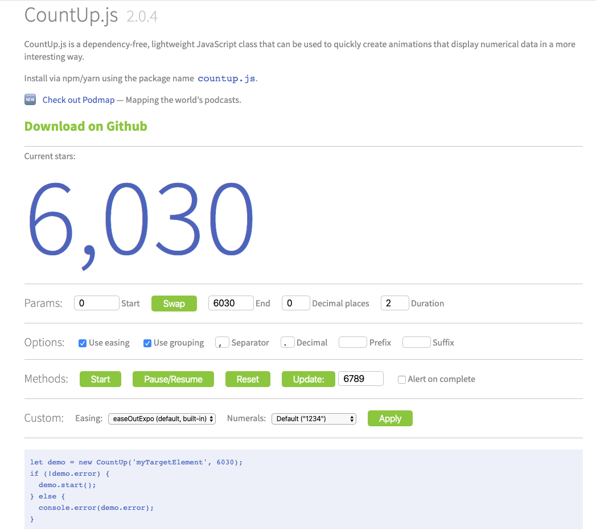

动画是游戏内必必不可少的功能，在AS3时代强大的类库TweenMax，在H5页游时代，各大引擎都有了自己的相对于TweenMax的部分功能的实现，Cocos Creator 还结合了Action 做了很多拓展，但是有时候我们需要一些常见的功能比如对于数字变化的效果，此时如果自己写就要控制好很多参数，那么网上有没有轮子呢，答案是：有
<!--more-->

## 介绍

**CountUp.js** 是一个零依赖的轻量a级 JavaScript 库，可用于快速创建以更有趣的方式显示数字的动画。虽然这个是个H5页面的类库，但是不影响把他迁移到Cocos Creator 项目里。这个库有Typescript和JavaScript版本，还有演示的官网。可以说对于游戏开发者和想省事的开发者确实是个福音。

说干就干，接下来先放上两个链接：

- 代码库地址：[点击进入](https://github.com/inorganik/countUp.js)
- 演示地址：[点击进入](https://inorganik.github.io/countUp.js/)

演示地址样式：



可以看出 有很多可以配置的参数和选项：

### 参数:

- `target` =  html元素的id，input，svg text元素，或者计数发生时先前选择的元素/输入的var
- `startVal` = 你要开始的值
- `endVal` = 你想要达到的价值
- `decimals` = （可选）数字中的小数位数，默认为0
- `duration` = （可选）持续时间（以秒为单位），默认为2
- `options` = （可选，请参阅demo）格式化/easing选项对象

可以省略小数，持续时间和选项以使用默认值。

比如：

```javascript
const options = {
  decimalPlaces: 2,
};
let demo = new CountUp('myTargetElement', 6750.99, options);
if (!demo.error) {
  demo.start();
} else {
  console.error(demo.error);
}
```

或者：

```javascript
numAnim.start(someMethodToCallOnComplete);

// or an anonymous function
numAnim.start(function() {
    // do something
})
```

接下来说说如何修改 其实 就是修改 ：`target` 和 `printValue()` 这个方法：

`target`赋值 原代码：

```javascript
this.el = (typeof target === 'string') ? document.getElementById(target) : target;
```

修改为：

```javascript
this.el = target;
```

`printValue()` 方法 原代码：

```javascript
    CountUp.prototype.printValue = function (val) {
        var result = this.formattingFn(val);
        if (this.el.tagName === 'INPUT') {
            var input = this.el;
            input.value = result;
        }
        else if (this.el.tagName === 'text' || this.el.tagName === 'tspan') {
            this.el.textContent = result;
        }
        else {
            this.el.innerHTML = result;
        }
    };
```

修改为：

```javascript
    CountUp.prototype.printValue = function (val) {
        var result = this.formattingFn(val);
       	this.el.string = result;
    };
```

此时我们应该这样调用：

```javascript
const options = {
  startVal: 50,//开始的值
  decimalPlaces: 2,//小数点后几位
  duration: 2.0,//多久时间
  useGrouping: false,
};
let myTargetElement = XXXXX（类型为cc.Label类型）
let demo = new CountUp(myTargetElement, 94.62, options);
if (!demo.error) {
  demo.start();
} else {
  console.error(demo.error);
}
```


以上就是这个数字动画的用法。

**-----------------2021-05-12更新-----------------**

### TypeScript版本

之前介绍了Javascript版本的使用，现在Cocos Creator 3.0 开始 全面使用Typescript版本了，那下面就是Typescript版本的修改后的代码

```typescript
export interface CountUpOptions { // (default)
    startVal?: number | string; // number to start at (0)
    decimalPlaces?: number; // number of decimal places (0)
    duration?: number; // animation duration in seconds (2)
    useGrouping?: boolean; // example: 1,000 vs 1000 (true)
    useEasing?: boolean; // ease animation (true)
    smartEasingThreshold?: number; // smooth easing for large numbers above this if useEasing (999)
    smartEasingAmount?: number; // amount to be eased for numbers above threshold (333)
    separator?: string; // grouping separator (,)
    decimal?: string; // decimal (.)
    // easingFn: easing function for animation (easeOutExpo)
    easingFn?: (t: number, b: number, c: number, d: number) => number;
    formattingFn?: (n: number) => string; // this function formats result
    prefix?: string; // text prepended to result
    suffix?: string; // text appended to result
    numerals?: string[]; // numeral glyph substitution
}

// playground: stackblitz.com/edit/countup-typescript
export class CountUp {
    version = '2.0.7';
    private defaults: CountUpOptions = {
        startVal: 0,
        decimalPlaces: 0,
        duration: 2,
        useEasing: true,
        useGrouping: true,
        smartEasingThreshold: 999,
        smartEasingAmount: 333,
        separator: ',',
        decimal: '.',
        prefix: '',
        suffix: ''
    };
    private el: any;
    private rAF: any;
    private startTime: number | null = null;
    private remaining: number = 0;
    private finalEndVal: number | null = null; // for smart easing
    private useEasing = true;
    private countDown = false;
    formattingFn: (num: number) => string;
    easingFn: (t: number, b: number, c: number, d: number) => number;
    callback: (args?: any) => any = null!;
    error = '';
    startVal = 0;
    duration: number = 2;
    paused = true;
    frameVal: number;

    constructor(
        private target: any,
        private endVal: number,
        public options: CountUpOptions
    ) {
        this.options = Object.assign(this.defaults, options);
        this.formattingFn = (this.options.formattingFn) ?
            this.options.formattingFn : this.formatNumber;
        this.easingFn = (this.options.easingFn) ?
            this.options.easingFn : this.easeOutExpo;
        this.endVal = this.validateValue(endVal);
        let startVal = Number(this.options.startVal || this.endVal);
        this.startVal = this.validateValue(startVal);
        this.frameVal = this.startVal;

        const decimalPlaces = this.options.decimalPlaces || 0;
        this.options.decimalPlaces = Math.max(0, decimalPlaces);
        this.resetDuration();
        this.options.separator = String(this.options.separator);
        this.options.useEasing = this.options.useEasing || false;
        this.useEasing = this.options.useEasing;
        if (this.options.separator === '') {
            this.options.useGrouping = false;
        }
        this.el = target;
        if (this.el) {
            this.printValue(this.startVal);
        } else {
            this.error = '[CountUp] target is null or undefined';
        }
        console.log("smile----this.options:" + JSON.stringify(this.options));
    }

    // determines where easing starts and whether to count down or up
    private determineDirectionAndSmartEasing() {
        const end = (this.finalEndVal) ? this.finalEndVal : this.endVal;
        this.countDown = (this.startVal > end);
        const animateAmount = end - this.startVal;
        this.options.smartEasingThreshold = this.options.smartEasingThreshold || 0;
        this.options.smartEasingAmount = this.options.smartEasingAmount || 0;
        if (Math.abs(animateAmount) > this.options.smartEasingThreshold) {
            this.finalEndVal = end;
            const up = (this.countDown) ? 1 : -1;
            this.endVal = end + (up * this.options.smartEasingAmount);
            this.duration = this.duration / 2;
        } else {
            this.endVal = end;
            this.finalEndVal = null;
        }
        if (this.finalEndVal) {
            this.useEasing = false;
        } else {
            this.options.useEasing = this.options.useEasing || false;
            this.useEasing = this.options.useEasing;
        }
    }

    // start animation
    start(callback?: (args?: any) => any) {
        if (this.error) {
            return;
        }
        if (callback) this.callback = callback;
        if (this.duration > 0) {
            this.determineDirectionAndSmartEasing();
            this.paused = false;
            this.rAF = requestAnimationFrame(this.count);
        } else {
            this.printValue(this.endVal);
        }
    }

    // pause/resume animation
    pauseResume() {
        if (!this.paused) {
            cancelAnimationFrame(this.rAF);
        } else {
            this.startTime = null;
            this.duration = this.remaining;
            this.startVal = this.frameVal;
            this.determineDirectionAndSmartEasing();
            this.rAF = requestAnimationFrame(this.count);
        }
        this.paused = !this.paused;
    }

    // reset to startVal so animation can be run again
    reset() {
        cancelAnimationFrame(this.rAF);
        this.paused = true;
        this.resetDuration();
        let startVal = Number(this.options.startVal || this.endVal);
        this.startVal = this.validateValue(startVal);
        this.frameVal = this.startVal;
        this.printValue(this.startVal);
    }

    // pass a new endVal and start animation
    update(newEndVal: string | number) {
        cancelAnimationFrame(this.rAF);
        this.startTime = null;
        this.endVal = this.validateValue(newEndVal);
        if (this.endVal === this.frameVal) {
            return;
        }
        this.startVal = this.frameVal;
        console.log("smile----this.frameVal:" + this.frameVal);
        if (!this.finalEndVal) {
            this.resetDuration();
        }
        this.finalEndVal = null;
        this.determineDirectionAndSmartEasing();
        this.rAF = requestAnimationFrame(this.count);
    }

    count = (timestamp: number) => {
        if (!this.startTime) {
            this.startTime = timestamp;
        }

        const progress = timestamp - this.startTime;
        this.remaining = this.duration - progress;

        // to ease or not to ease
        if (this.useEasing) {
            if (this.countDown) {
                this.frameVal = this.startVal - this.easingFn(progress, 0, this.startVal - this.endVal, this.duration);
            } else {
                this.frameVal = this.easingFn(progress, this.startVal, this.endVal - this.startVal, this.duration);
            }
        } else {
            if (this.countDown) {
                this.frameVal = this.startVal - ((this.startVal - this.endVal) * (progress / this.duration));
            } else {
                this.frameVal = this.startVal + (this.endVal - this.startVal) * (progress / this.duration);
            }
        }

        // don't go past endVal since progress can exceed duration in the last frame
        if (this.countDown) {
            this.frameVal = (this.frameVal < this.endVal) ? this.endVal : this.frameVal;
        } else {
            this.frameVal = (this.frameVal > this.endVal) ? this.endVal : this.frameVal;
        }

        // decimal
        this.frameVal = Number(this.frameVal.toFixed(this.options.decimalPlaces));

        // format and print value
        this.printValue(this.frameVal);

        // whether to continue
        if (progress < this.duration) {
            this.rAF = requestAnimationFrame(this.count);
        } else if (this.finalEndVal !== null) {
            // smart easing
            this.update(this.finalEndVal);
        } else {
            if (this.callback) {
                this.callback();
            }
        }
    }

    printValue(val: number) {
        this.el.string = this.formattingFn(val);
    }

    ensureNumber(n: any) {
        return (typeof n === 'number' && !isNaN(n));
    }

    validateValue(value: string | number): number {
        const newValue = Number(value);
        if (!this.ensureNumber(newValue)) {
            this.error = `[CountUp] invalid start or end value: ${value}`;
            return 0;
        } else {
            return newValue;
        }
    }

    private resetDuration() {
        this.startTime = null;
        this.duration = Number(this.options.duration) * 1000;
        this.remaining = this.duration;
    }

    // default format and easing functions

    formatNumber = (num: number): string => {
        const neg = (num < 0) ? '-' : '';
        let result: string,
            x: string[],
            x1: string,
            x2: string,
            x3: string;
        result = Math.abs(num).toFixed(this.options.decimalPlaces);
        result += '';
        x = result.split('.');
        x1 = x[0];
        x2 = x.length > 1 ? this.options.decimal + x[1] : '';
        if (this.options.useGrouping) {
            x3 = '';
            for (let i = 0, len = x1.length; i < len; ++i) {
                if (i !== 0 && (i % 3) === 0) {
                    x3 = this.options.separator + x3;
                }
                x3 = x1[len - i - 1] + x3;
            }
            x1 = x3;
        }
        // optional numeral substitution
        let numerals = this.options.numerals || [];
        if (numerals && numerals.length) {
            x1 = x1.replace(/[0-9]/g, (w) => numerals[+w]);
            x2 = x2.replace(/[0-9]/g, (w) => numerals[+w]);
        }
        return neg + this.options.prefix + x1 + x2 + this.options.suffix;
    }

    easeOutExpo = (t: number, b: number, c: number, d: number): number => {
        return c * (-Math.pow(2, -10 * t / d) + 1) * 1024 / 1023 + b;
    }
}

```


源码：CountUp.ts [点击进入](https://github.com/jsroads/mylibs/blob/main/CountUp/CountUp.ts)

## 参考

- [CountUp.js – 有趣的数字动画库](http://f2ex.cn/countup-js/)
- [CountUp.js Demo](https://inorganik.github.io/countUp.js/) 