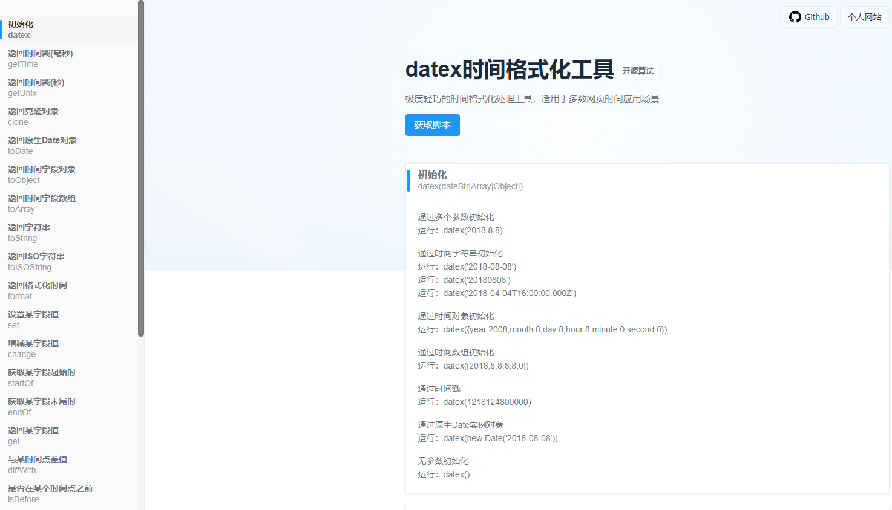
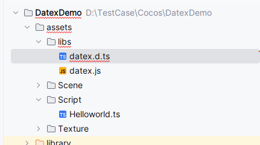
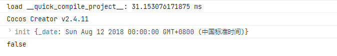

最近阅读文章的时候，看到一个轻量级的日期处理库，觉得还不错，于是就拿来跟`CocosCreator`结合一下，后面遇到项目需求的时候，可以直接拿来当作工具库使用，下面就简单的介绍一下这个库的用法。
<!--more-->
这个文章的起因就是因为一篇文章开始了我兴趣的，[new Date() 我忍你很久了！](https://juejin.cn/post/7221884988492382267) 我们知道，原生的`Javascript`对日期函数有很多地方和平时不一样，如文章里提到的月份从0 开始，自动转换等等，其实两年前笔者也曾在这个上面摔过脚，比如 符合 [RFC2822](https://tools.ietf.org/html/rfc2822#page-14) 或 ISO 8601 日期格式的字符串（其他格式也许也支持，但结果可能与预期不符）。

## 其他日期库

这篇文章之前，笔者也了解过其他几个日期处理库，比如

早期流行的 `Moment.js`

文档： [https://momentjs.com/](https://momentjs.com/)

地址：[https://github.com/moment/moment](https://github.com/moment/moment)

`Moment.js` 是一个 JavaScript 日期处理类库（处理时间格式化的npm包）,用于解析、检验、操作、以及显示日期，在新公司的项目中,大量使用Moment来处理时间日期,非常方便好用。

现在比较流行的：`dayjs`

官网：https://day.js.org

地址：[https://github.com/iamkun/dayjs](https://github.com/iamkun/dayjs)

以及后起之秀 date-fns

 网站地址：[https://date-fns.org](https://date-fns.org)

`GitHub`：[https://github.com/date-fns/date-fns](https://github.com/date-fns/date-fns)

`ate-fns`，一个现代 JavaScript 日期实用程序库。date-fns 提供了最全面，最简单和一致的工具集，用于在浏览器和 Node.js 中操作 JavaScript 日期。

## datex日期处理



这里关于`API` 不再赘述，大家可以直接点击官网去看[ Github](https://github.com/mumuy/datex/) 和 [个人网站](https://passer-by.com/)的具体用法和说明。

## 生成声明文件.d.ts

由于原作者没有提供Typescript版本的声明文件（`.d.ts`）所以需要我们自己生成，这里说一下如何生成Typescript项目可以用的带声明文件，

首先我们修改源代码的 src/js 代码的最后一行：
原代码：

```javascript
export default datex;
```

修改后

```javascript
export {datex};
```

然后使用一个一个npm 工具类库生成 ，这个类库之前的文章有介绍：[dts-gen](https://github.com/Microsoft/dts-gen)

工具安装完成后，还需要继续安装一个依赖库（不安装本地报错）

```bash
npm i tern --save-dev
```

然后运行生成声明文件：

```bash
D:\Jstest\dts-gen-master (dts-gen@0.6.1)
λ npx dtsmake -s datex.js
npx: 31 安装成功，用时 20.949 秒
v:6.14.18

dtsmake started.
[CMD]node "D:\Jstest\dts-gen-master\node_modules/tern/bin/condense" datex.js --no-spans
[SRC]datex.js
File saved. (datex.d.ts)

D:\Jstest\dts-gen-master (dts-gen@0.6.1)
```

然后略加修改即可，下面我把修改后的声明文件 `datex.dts` 贴出：

```typescript
// Type definitions for datex.js
// Project: [LIBRARY_URL_HERE] 
// Definitions by: [YOUR_NAME_HERE] <[YOUR_URL_HERE]> 
// Definitions: https://github.com/borisyankov/DefinitelyTyped
declare namespace datex.prototype{
	// datex.prototype.toObject.!ret
	
	/**
	 * 
	 */
	interface ToObjectRet {
				
		/**
		 * 
		 */
		year : number;
				
		/**
		 * 
		 */
		month : number;
				
		/**
		 * 
		 */
		day : number;
				
		/**
		 * 
		 */
		hour : number;
				
		/**
		 * 
		 */
		minute : number;
				
		/**
		 * 
		 */
		second : number;
				
		/**
		 * 
		 */
		millsecond : number;
				
		/**
		 * 
		 */
		timestamp : number;
				
		/**
		 * 
		 */
		week : number;
	}
}
declare namespace datex.prototype{
	// datex.prototype.toArray.!ret
	type ToArrayRet = Array<any>;
}

/**
 * 
 */
declare namespace _langMap{
	
	/**
	 * 
	 */
	namespace "en-US"{
				
		/**
		 * 
		 */
		export var MMM : Array<string>;
				
		/**
		 * 
		 */
		export var MMMM : Array<string>;
				
		/**
		 * 
		 */
		export var Do : Array<string>;
				
		/**
		 * 
		 */
		export var WW : Array<string>;
				
		/**
		 * 
		 */
		export var WWW : Array<string>;
	}
	
	/**
	 * 
	 */
	namespace "zh-CN"{
				
		/**
		 * 
		 */
		export var MMM : Array<string>;
				
		/**
		 * 
		 */
		export var MMMM : Array<string>;
				
		/**
		 * 
		 */
		export var Do : Array<string>;
				
		/**
		 * 
		 */
		export var WW : Array<string>;
				
		/**
		 * 
		 */
		export var WWW : Array<string>;
	}
}

/**
 * 
 */
export declare var _lang : string;

/**
 * 
 */
export declare var _offset : number;

/**
 * 
 */
export declare var period : Array<string>;

/**
 * 
 */
export declare var initTime : Array<number>;

/**
 * 
 * @param date 
 * @param timeZone 
 * @return  
 */
declare function convertTimeZone(date : Date, timeZone : any): Date;

/**
 * 
 */
declare interface datex {
		
	/**
	 * 
	 * @param ...argu 
	 * @return  
	 */
	new (...argu : number): any;
		
	/**
	 * 
	 */
	_langMap : /*no type*/{};
		
	/**
	 * 
	 */
	_offset : number;
		
	/**
	 * 
	 * @param ...argu 
	 * @return  
	 */
	init(...argu : any): /* !this */ any;
		
	/**
	 * 
	 * @return  
	 */
	getTime(): number;
		
	/**
	 * 
	 * @return  
	 */
	getUnix(): number;
		
	/**
	 * 
	 * @return  
	 */
	clone(): any;
		
	/**
	 * 
	 * @return  
	 */
	toDate(): /* !this._date */ any;
		
	/**
	 * 
	 * @return  
	 */
	toObject(): /* datex.prototype.toObject.!ret */ any;
		
	/**
	 * 
	 * @return  
	 */
	toArray(): Array<any>;
		
	/**
	 * 
	 * @return  
	 */
	toISOString(): string;
		
	/**
	 * 
	 * @param unit 
	 * @param value 
	 * @return  
	 */
	set(unit : string, value : any): /* !this */ any;
		
	/**
	 * 
	 * @param unit 
	 */
	get(unit : string): void;
		
	/**
	 * 
	 * @param unit 
	 * @param value 
	 * @return  
	 */
	change(unit : string, value : number): datex;	
	/**
	 * 
	 */
	change();
		
	/**
	 * 
	 * @param pattern 
	 * @return  
	 */
	format(pattern : any): string;
		
	/**
	 * 
	 * @param unit 
	 * @return  
	 */
	startOf(unit : any): any;
		
	/**
	 * 
	 * @param unit 
	 * @return  
	 */
	endOf(unit : any): datex;	
	/**
	 * 
	 */
	endOf();
		
	/**
	 * 
	 * @param that 
	 * @param unit 
	 * @return  
	 */
	diffWith(that : any, unit : string): any;
		
	/**
	 * 
	 * @param that 
	 * @param unit 
	 * @return  
	 */
	isBefore(that : any, unit : any): boolean;
		
	/**
	 * 
	 * @param that 
	 * @param unit 
	 * @return  
	 */
	isAfter(that : any, unit : any): boolean;
		
	/**
	 * 
	 * @param that 
	 * @param unit 
	 * @return  
	 */
	isSame(that : any, unit? : any): boolean;
		
	/**
	 * 
	 * @param startDate 
	 * @param endDate 
	 * @param unit 
	 * @return  
	 */
	isBetween(startDate : any, endDate : any, unit : any): boolean;
		
	/**
	 * 
	 * @param lang 
	 * @param data 
	 * @return  
	 */
	setLanguage(lang : any, data : any): /* !this */ any;
		
	/**
	 * 
	 * @param lang 
	 * @return  
	 */
	switchLanguage(lang : any): /* !this */ any;
		
	/**
	 * 
	 * @param timezone 
	 */
	switchTimezone(timezone : any): void;
		
	/**
	 * 
	 */
	getTimezone(): void;
		
	/**
	 * 
	 * @return  
	 */
	getTimezoneOffset(): number;
		
	/**
	 * 
	 * @return  
	 */
	isValid(): boolean;
		
	/**
	 * 
	 */
	supportedTimezones : Array<any>;
}

/**
 * 
 * @param that 
 * @return  
 */
declare function getInstance(that : any): any;

/**
 * 
 * @param value 
 * @return  
 */
declare function isObject(value : number): boolean;


declare function datex(...args: string[] | number[] | Date[]): datex;

```

## 编写测试代码



`Helloworld.ts` 文件内容：

```typescript
import {datex} from "../libs/datex";


const {ccclass, property} = cc._decorator;

@ccclass
export default class Helloworld extends cc.Component {

    @property(cc.Label)
    label: cc.Label = null;

    @property
    text: string = 'hello';

    start () {
        // init logic
        this.label.string = this.text;
        let date1 = datex(2018,8,12)
        let isSame = datex('2008-08-08').isSame('2022-02-02')
        console.log(date1)
        console.log(isSame)
    }
}
```

运行测试结果如下：



以上，测试通过，可以正常使用！！

## 总结

日期库有很多个，做项目时候，我们经常根据需求选择字需要的即可！