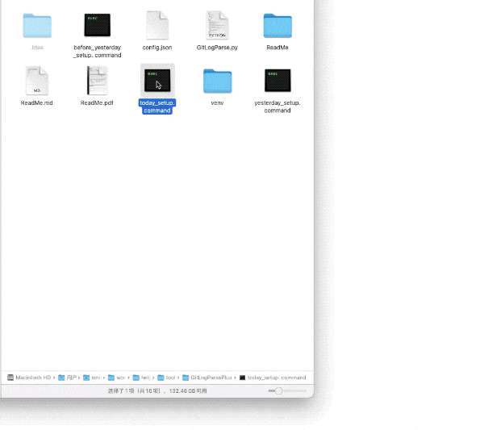
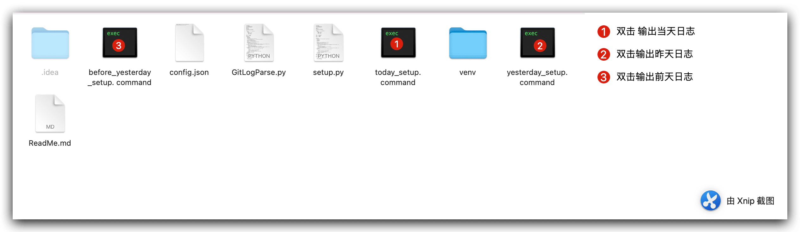
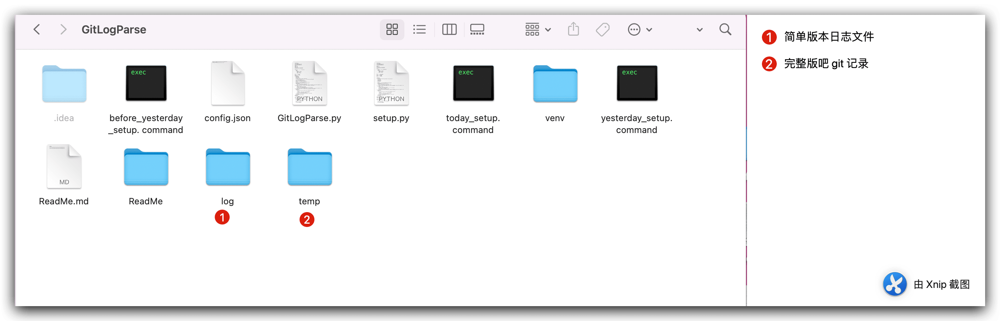

项目人多了，于是乎，领导开始想让大家每日写日报。作为程序员来说，写日志显得很扯，但是，领导说的，就得支持，哪怕自己不喜欢这个规则。没办法，于是乎想到能不能把每天的工作中，提交的日志的部分内容，作为日报，这样形式上总算有了，也能看看自己一天下来都做了哪些功能。
<!--more-->

### 最后效果



### 具体实现

先说一下我的思路，总体来说，需要配置几个东西

- 作者
- 仓库地址
- 生成某天

能够用到的几个类 大概是 `json` 、`os` 等类，于是乎开干吧，以前让同事写过一个类似的功能，于是站在别人的肩膀上开始修改，就容易的多。

先说说配置文件：我这里使用json 名字叫 config.json。

```json
{
  "log_paths": "自己日志的目录",
  "author": "自己的名字",
  "source_path": "自己仓库的地址"
}

```

比如这样

```json
{
  "log_paths": "/Users/smile/work/helper/tool/GitLogParsePlus/log",
  "author": "asroads",
  "source_path": "/Users/smile/work/ccc/demo"
}


```

python 文件 

```python
# coding:utf-8
import os
import re
import time
import json
import shutil
from time import strftime,gmtime
from optparse import OptionParser

CONST = {
    "LOG_FILE": ".log", # 保存日志的文件名
    # 正则
    "REGEX":{
        "COMMIT": "^commit",
        "AUTHOR": "^Author",
        "DATE": "^Date",
        "Merge": "^Merge",
        "#": "#",#Merge 代码内容不显示
    }
}
gAfter = "" # 开始时间
gBefore = "" # 结束时间
# 获取git日志
def getGitLog():
    global gAfter
    global gBefore
    global gDays
    cwd = os.getcwd()
    configPath = os.path.join(cwd, "config.json")
    f = open(configPath, encoding='utf-8')  # 打开‘copyConfig.json’的json文件
    res = f.read()  # 读文件
    author = json.loads(res)["author"]
    log_paths = json.loads(res)["log_paths"]
    source_path = json.loads(res)["source_path"]
    cmd = ""
    today_date = time.strftime("%Y-%m-%d", time.localtime())
    my_file_name = today_date+CONST["LOG_FILE"]
    # 默认为今天的时间
    if gAfter == None and gBefore == None and gDays ==None:
        nowTime = strftime("%Y-%m-%d", gmtime())
        cmd = "cd \"{0}\";git log --author=\"{1}\" --after=\"{2} 00:00:00\" --before=\"{3} 24:00:00\" > {4}/{5}".format(source_path, author, nowTime, nowTime, getRunPath(), my_file_name)
    elif gDays:
        ticks = time.time()
        timeStamp = ticks-int(gDays)*24*60*60
        localtime = time.strftime("%Y-%m-%d", time.localtime(timeStamp))
        my_file_name = localtime+CONST["LOG_FILE"]
        cmd = "cd \"{0}\";git log --author=\"{1}\" --after=\"{2} 00:00:00\" --before=\"{3} 24:00:00\" > {4}/{5}".format(source_path, author, localtime, localtime, getRunPath(), my_file_name)
    # 根据参数的时间
    else:
        cmd = "cd \"{0}\";git log --author=\"{1}\"".format(source_path, author)
        if gBefore:
            cmd = "{0} --before=\"{1}\"".format(cmd, gBefore)
        if gAfter:
            cmd = "{0} --after=\"{1}\"".format(cmd, gAfter)
        my_file_name = gAfter+CONST["LOG_FILE"]
        cmd = "{0} > {1}/{2}".format(cmd, getRunPath(), my_file_name)
    print("执行命令：{}".format(cmd))
    os.system(cmd)
    parseLog(my_file_name,log_paths)
#获取运行目录
def getRunPath():
   return os.path.split(os.path.realpath(__file__))[0]

# 解析日志
def parseLog(my_file_name,log_paths):
    print("================LOG====================")
    logPath = getRunPath() + "/" + my_file_name
    savePath = log_paths + "/" + my_file_name
    tempPath = getRunPath() + "/temp"
    if not os.path.exists(tempPath):
        os.makedirs(tempPath)
    if not os.path.exists(log_paths):
        os.makedirs(log_paths)
    saveFile = open(savePath,"w+")
    saveFile.writelines("今日工作内容：\n")
    idx = 1
    logFile = open(logPath)
    for line in logFile:
        line = line.strip()
        if len(line) == 0:
            continue
        reCommit = re.match(CONST["REGEX"]["COMMIT"], line)
        reAuthor = re.match(CONST["REGEX"]["AUTHOR"], line)
        reDate = re.match(CONST["REGEX"]["DATE"], line)
        reMerge = re.match(CONST["REGEX"]["Merge"], line)
        reSpec = re.match(CONST["REGEX"]["#"], line)

        if reCommit or reAuthor or reDate or reMerge or reSpec:
            continue
        else:
            print(line)
            saveFile.writelines(str(idx)+"."+line+"\n")
            idx = idx+1
    saveFile.close()
    logFile.close()
    shutil.move(logPath,tempPath+"/"+my_file_name)
    print("=======================================")
    print("汪~赶快粘贴到每天的日报吧^_^")

if __name__ == '__main__':
    # 进行参数解析
    parser = OptionParser()
    parser.add_option(
        "--after",
        action="store",
        dest="after",
        help="开始时间(如果after和before都不填写，默认为当天时间)"
    )
    parser.add_option(
        "--before",
        action="store",
        dest="before",
        help="结束时间(如果after和before都不填写，默认为当天时间)"
    )
    parser.add_option(
        "--days",
        action="store",
        dest="days",
        help="距离当前日期的天数(比如1代表昨天，2代表前天)"
    )
    (opts, args) = parser.parse_args()
    gAfter = opts.after
    gBefore = opts.before
    gDays = opts.days
    getGitLog()


```

生成几个 常用的 命令行文件 比如当天的 `today_setup. command`

```bash
#!/bin/bash
printf "Shell 脚本开始执行 \n"
base_dir=$(cd "$(dirname "$0")";pwd)
printf "当前路径:%s \n" $base_dir
cd $base_dir
python3 GitLogParse.py
printf "Shell 脚本开始执行 完毕！！！ \n"

```

昨天的 `yesterday_setup. command`

```bash
#!/bin/bash
printf "Shell 脚本开始执行 \n"
base_dir=$(cd "$(dirname "$0")";pwd)
printf "当前路径:%s \n" $base_dir
cd $base_dir
python3 GitLogParse.py --days 1
printf "Shell 脚本开始执行 完毕！！！ \n"
```

前天的 `before_yesterday_setup. command`

```bash
#!/bin/bash
printf "Shell 脚本开始执行 \n"
base_dir=$(cd "$(dirname "$0")";pwd)
printf "当前路径:%s \n" $base_dir
cd $base_dir
python3 GitLogParse.py --days 2
printf "Shell 脚本开始执行 完毕！！！ \n"
```

如果直接使用命令行 ：`--days` 2 表示 2天前的某天 如果是5 就是5天前那天

```bash
python3 GitLogParse.py --days 2
```

具体的说明如下：



生成路径




最后源码地址：[点击进入](https://github.com/jsroads/mylibs/tree/main/GitLogParsePlus)

### 2022-08-15 windows 版本

脚本变化不大，但是遇到了问题：

1. 调用脚本的时候 遇到 `文件名、目录名或卷标语法不正确` 错误 我的修改方法是 将命令拆成两个分别执行
2. `os.system cd`无效  原因是 `python`中和`os.system`实现机制有关系。

修复方法 修改用 os.chdir(‘/home/data)  代替

3. `UnicodeDecodeError: 'gbk' codec can't decode byte 0x80 in position 78: illegal multibyte sequence`

修复方法 `open(logPath, 'r', encoding='utf-8')`

下面是`GitLogParse.py`源码：

```python
# coding:utf-8
import os
import re
import time
import json
import shutil
from time import strftime,gmtime
from optparse import OptionParser

CONST = {
    "LOG_FILE": ".log", # 保存日志的文件名
    # 正则
    "REGEX":{
        "COMMIT": "^commit",
        "AUTHOR": "^Author",
        "DATE": "^Date",
        "Merge": "^Merge",
        "#": "#",#Merge 代码内容不显示
    }
}
gAfter = "" # 开始时间
gBefore = "" # 结束时间
# 获取git日志
def getGitLog():
    global gAfter
    global gBefore
    global gDays
    cwd = os.getcwd()
    configPath = os.path.join(cwd, "config.json")
    f = open(configPath, encoding='utf-8')  # 打开‘copyConfig.json’的json文件
    res = f.read()  # 读文件
    author = json.loads(res)["author"]
    log_paths = json.loads(res)["log_paths"]
    source_path = json.loads(res)["source_path"]
    cmd1 = ""
    cmd2 = ""
    today_date = time.strftime("%Y-%m-%d", time.localtime())
    my_file_name = today_date+CONST["LOG_FILE"]
    # 默认为今天的时间
    if gAfter == None and gBefore == None and gDays ==None:
        nowTime = strftime("%Y-%m-%d", gmtime())
        cmd1 = "{0}".format(source_path)
        cmd2 = "git log --author=\"{0}\" --after=\"{1} 00:00:00\" --before=\"{2} 24:00:00\" > {3}/{4}".format(author, nowTime, nowTime, getRunPath(), my_file_name)
    elif gDays:
        ticks = time.time()
        timeStamp = ticks-int(gDays)*24*60*60
        localtime = time.strftime("%Y-%m-%d", time.localtime(timeStamp))
        my_file_name = localtime+CONST["LOG_FILE"]
        cmd1 = "{0}".format(source_path)
        cmd2 = "git log --author=\"{0}\" --after=\"{1} 00:00:00\" --before=\"{2} 24:00:00\" > {3}/{4}".format(author, localtime, localtime, getRunPath(), my_file_name)
    # 根据参数的时间
    else:
        cmd1 = "{0}".format(source_path)
        cmd2 = "git log --author=\"{0}\"".format(author)
        if gBefore:
            cmd2 = "{0} --before=\"{1}\"".format(cmd2, gBefore)
        if gAfter:
            cmd2 = "{0} --after=\"{1}\"".format(cmd2, gAfter)
        my_file_name = gAfter+CONST["LOG_FILE"]
        cmd2 = "{0} > {1}/{2}".format(cmd2, getRunPath(), my_file_name)
    print("执行命令：{}".format(cmd2))
    os.chdir(cmd1)
    os.system(cmd2)
    parseLog(my_file_name,log_paths)
#获取运行目录
def getRunPath():
   return os.path.split(os.path.realpath(__file__))[0]

# 解析日志
def parseLog(my_file_name,log_paths):
    print("================LOG====================")
    logPath = getRunPath() + "/" + my_file_name
    savePath = log_paths + "/" + my_file_name
    tempPath = getRunPath() + "/temp"
    if not os.path.exists(tempPath):
        os.makedirs(tempPath)
    if not os.path.exists(log_paths):
        os.makedirs(log_paths)
    saveFile = open(savePath,"w+")
    saveFile.writelines("今日工作内容：\n")
    idx = 1
    logFile = open(logPath, 'r', encoding='utf-8')
    for line in logFile:
        line = line.strip()
        if len(line) == 0:
            continue
        reCommit = re.match(CONST["REGEX"]["COMMIT"], line)
        reAuthor = re.match(CONST["REGEX"]["AUTHOR"], line)
        reDate = re.match(CONST["REGEX"]["DATE"], line)
        reMerge = re.match(CONST["REGEX"]["Merge"], line)
        reSpec = re.match(CONST["REGEX"]["#"], line)

        if reCommit or reAuthor or reDate or reMerge or reSpec:
            continue
        else:
            print(line)
            saveFile.writelines(str(idx)+"."+line+"\n")
            idx = idx+1
    saveFile.close()
    logFile.close()
    shutil.move(logPath,tempPath+"/"+my_file_name)
    print("=======================================")
    print("汪~赶快粘贴到每天的日报吧^_^")

if __name__ == '__main__':
    # 进行参数解析
    parser = OptionParser()
    parser.add_option(
        "--after",
        action="store",
        dest="after",
        help="开始时间(如果after和before都不填写，默认为当天时间)"
    )
    parser.add_option(
        "--before",
        action="store",
        dest="before",
        help="结束时间(如果after和before都不填写，默认为当天时间)"
    )
    parser.add_option(
        "--days",
        action="store",
        dest="days",
        help="距离当前日期的天数(比如1代表昨天，2代表前天)"
    )
    (opts, args) = parser.parse_args()
    gAfter = opts.after
    gBefore = opts.before
    gDays = opts.days
    getGitLog()


```

`config.json`

```json
{
  "log_paths": "D:\\Test\\PycharmProjects\\WindowsGitLogHelper\\log",
  "author": "jsroads",
  "source_path": "D:/Refactor/client"
}
```

windows 源码 [点击进入](https://github.com/jsroads/mylibs/tree/main/GitLogParsePlus/windows)

#### 参考

- [python中os.system cd无效](https://blog.csdn.net/qq_24920947/article/details/81979397)
- [Python读取文件时出现UnicodeDecodeError: ‘gbk‘ codec can‘t decode byte 0x80 in position ...](https://blog.csdn.net/qq_31267769/article/details/109128882)

### 总结

代码没有什么难度，主要是一点点拼凑的，一点点进步吧！加油。

