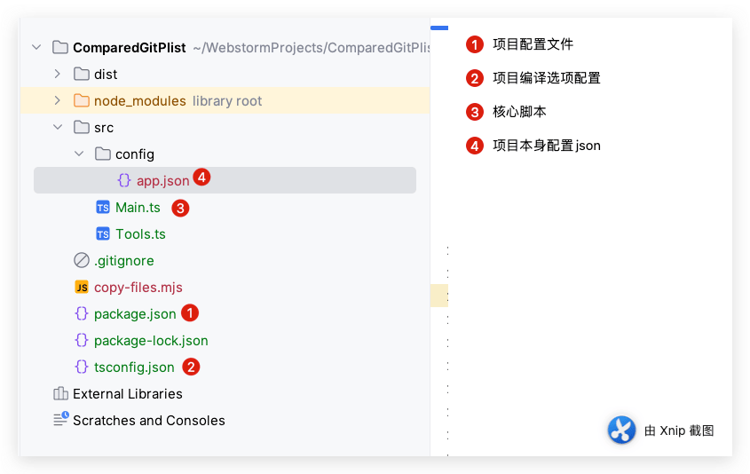
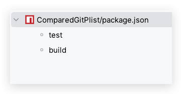

最近的工作经常会合并分支到小游戏渠道，一下子几千个文件变更，其中很多是合图资源的冲突，由于项目使用了`TexturePacker`的静态合同工具，之前的做法是所有的合同重新批量导出，但是为了避免后面减少和其他分支冲突文件的个数，于是尽可能的保持和其他分支变更的文件个数和内容。于是下面的工具诞生了，这个工具主要是使用`ts-node`编写`Typescript`实现`node`脚本批量对比文件作出对不需要变化的文件进行git还原。
<!--more-->

## 功能

使用`ts-node`编写`Typescript`实现`node`脚本批量对比文件作出对不需要变化的文件进行git还原。

## 涉及知识以及环境

- `npm`
- [ts-node](https://typestrong.org/ts-node/)
- [simple-git](https://www.npmjs.com/package/simple-git)
- [shelljs](https://www.npmjs.com/package/shelljs)
- [cpy](https://www.npmjs.com/package/cpy)

```shell
# 全局安装 ts-node、simple-git、shelljs
npm install -g ts-node simple-git shelljs cpy

# 在您的项目中本地安装这些包
npm install ts-node simple-git shelljs cpy

```

## 文件结构



`package.json`

```json
{
  "name": "shelljs-demo",
  "version": "1.0.0",
  "description": "",
  "main": "index.js",
  "scripts": {
    "test": "echo \"Error: no test specified\" && exit 1",
    "build": "node copy-files.mjs && tsc"
  },
  "keywords": [],
  "author": "",
  "license": "ISC",
  "dependencies": {
    "@types/fs-extra": "^11.0.4",
    "@types/shelljs": "^0.8.15",
    "fs-extra": "^11.2.0",
    "shelljs": "^0.8.5",
    "simple-git": "^3.24.0"
  },
  "devDependencies": {
    "@types/node": "^20.11.30",
    "cpy": "^11.0.1",
    "ts-node": "^10.9.2",
    "tslib": "^2.6.2",
    "typescript": "^5.4.3"
  }
}

```

`copy-files.mjs`

```javascript
import { fileURLToPath } from 'url';
import path from 'path';
import cpy from 'cpy';
import fse from 'fs-extra';

// 获取当前文件所在的目录路径
const __filename = fileURLToPath(import.meta.url);
const __dirname = path.dirname(__filename);
const distDir = path.join(__dirname, 'dist');
const targetDir = path.join(__dirname, 'dist',"src",'config');

// 删除 dist 目录
fse.remove(distDir)
    .then(() => {
        console.log('Deleted dist directory successfully!');
        // 复制文件到 dist 目录
        return cpy(['src/config/app.json'], targetDir, { concurrency: 10 });
    })
    .then(() => {
        console.log('app.json copied successfully!');
    })
    .catch(err => {
        console.error('Error:', err);
    });

```

`Main.ts`

```typescript
import path from 'path';
import fse from 'fs-extra';
import simpleGit, { SimpleGit, StatusResult } from 'simple-git';
import { exec } from 'shelljs';
import { DiffResultTextFile } from "simple-git/dist/typings/response";

export interface appConfigRootObject {
    localPath: string;
    remoteUrl: string;
    branch: string;
    fileTypes: string[]; // 修改为数组
}

async function getModifiedFiles(git: SimpleGit): Promise<StatusResult> {
    const statusSummary = await git.status();
    return statusSummary;
}

async function hasSingleLineDifference(git: SimpleGit, branch: string, filePath: string): Promise<boolean> {
    const diffSummary = await git.diffSummary([`${branch}:${filePath}`, filePath]);
    if (diffSummary.files.length !== 1 || diffSummary.files[0].binary) {
        return false;
    }

    const fileDiff: DiffResultTextFile = diffSummary.files[0] as DiffResultTextFile;

    return fileDiff.changes === 2;
}

async function abandonFiles(git: SimpleGit, files: string[]): Promise<void> {
    await git.checkout(files);
}

async function compareFiles(): Promise<void> {
    try {
        const configFile = await fse.readFile(path.join(__dirname, 'config/app.json'), 'utf-8');
        const config: appConfigRootObject = JSON.parse(configFile);

        const { localPath, branch, fileTypes } = config;

        const git = simpleGit(localPath);
        await git.pull('origin', branch);

        const status: StatusResult = await getModifiedFiles(git);

        const filesToAbandon: string[] = [];

        const localModifiedFiles: string[] = status.modified.filter(file => {
            return fileTypes.some(type => file.endsWith(type));
        });

        for (const file of localModifiedFiles) {
            const hasDiff = await hasSingleLineDifference(git, branch, file);
            if (hasDiff) {
                const content = await fse.readFile(path.join(localPath, file), 'utf-8');
                const regex = /<string>\$TexturePacker:SmartUpdate:[0-9a-fA-F]{32}:[0-9a-fA-F]{32}:[0-9a-fA-F]{32}\$<\/string>/;
                if (regex.test(content)) {
                    console.log(`文件路径：${file}`);
                    console.log('---------------------');
                    filesToAbandon.push(file)
                    // 检查同目录下是否存在同名的 PNG 文件
                    const pngFile = file.replace(/\.\w+$/, '.png');
                    const pngStatus = await git.status([pngFile]);
                    if (pngStatus && pngStatus.files && pngStatus.files.length > 0) {
                        const pngChanges = pngStatus.files.filter(item => item.path === pngFile);
                        if (pngChanges && pngChanges.length > 0) {
                            filesToAbandon.push(pngFile);
                        }
                    }
                }
            }
        }

        if (filesToAbandon.length > 0) {
            // console.log('需要放弃的文件列表：', filesToAbandon);
            console.table(filesToAbandon);
            await abandonFiles(git, filesToAbandon);
            console.log('放弃操作完成。');
        } else {
            console.log('没有需要放弃的文件。');
        }

        exec('echo "这是一个示例命令"');
    } catch (err) {
        console.error('读取配置或比较文件时出现错误：', err);
    }
}

compareFiles();

```

`src/config/app.json`

```json
{
  "localPath": "/Users/smile/Work/WorkSpace/WechatPlus",
  "remoteUrl": "https://xxxxx.net/xxxxxx/xxxx/xxxx-client.git",
  "branch": "mini/wx_light3",
  "fileTypes": [".plist",".png"]
}

```

## 脚本运行

### Ts-node运行

```
ts-node src/Main.ts
```

### 使用npm Sripts构建项目

我这里使用`Webstorm`打开项目（你可以根据自己的编辑器而定）

1. 选中`package.json`文件 右键选择 `Show npm Scripts`

​	

2. 此时 下面出现了 我们的构建任务



​	对应的脚本：

```json
"scripts": {
    "test": "echo \"Error: no test specified\" && exit 1",
    "build": "node copy-files.mjs && tsc"
  }
```

解释，之所以先进行脚本复制 后进行编译 是因为 复制脚本会删除之前的脚本。

源码地址：[点击前往](https://github.com/jsroads/mylibs/tree/main/ComparedGitPlist)

### 总结

这个脚本主要是判断`TexturePacker` 批量导出合图后 判断生成的plist文件如果有且仅有一行有更改且这一行的代码是关于文件时间戳的，就认为这个合图没有变化，就会把对应`plist`和`png`文件还原。

其实，之所以写这篇文章，是之前一直没有研究过使用node运行Typescript脚本，工程化构建，本次写这个小的功能算是一次小的尝试。功能需求是可以变化的，但有了对这个项目和环境的熟悉和深入学习，就会创建出更多的功能，实现更复杂的需求。故不积跬步，无以至千里；不积小流，无以成江海。
