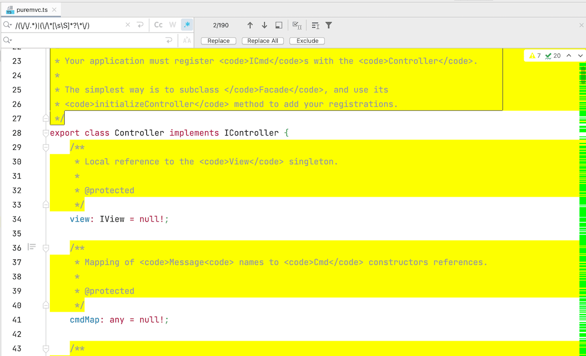
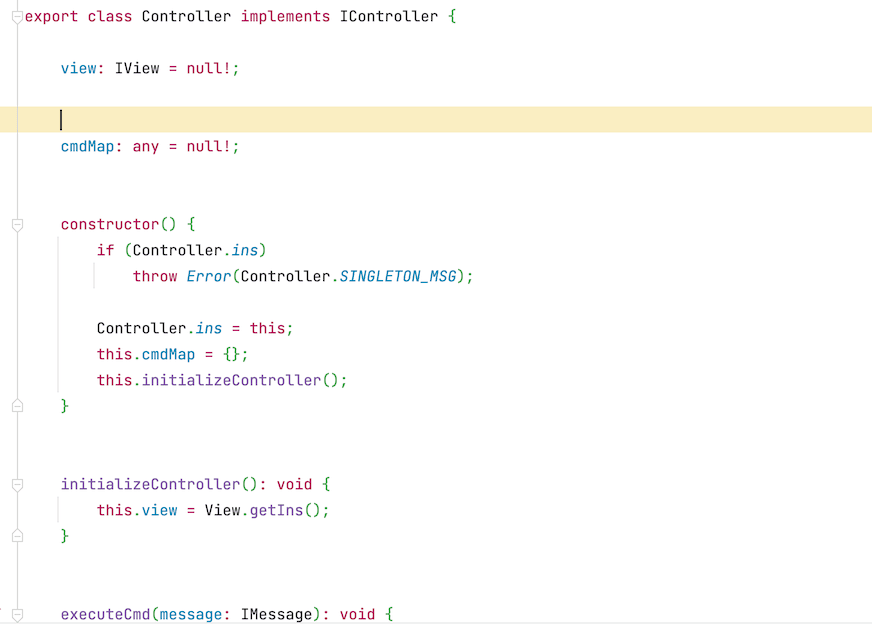

从网上下载了一个Typescript的类库，文件自带了几百个注释（注释都是英文的），API都熟悉，所以想简单的瘦身一下，删除注释就想到了正则替换。
<!--more-->
注释样式

```typescript
/**
 * Created by jsroads on 2021/4/12.1:46 下午
 * Note:
 */
```

注释的正则

```typescript
 var reg = /(\/\/.*)|(\/\*[\s\S]*?\*\/)/g;
```

### 步骤

1. 打开webstorm 选择文件 查找替换
2. 选择正则模式
3. 填写正则表达式 `/(\/\/.*)|(\/\*[\s\S]*?\*\/)`，选择替换为空



4. 点击 Replace All 完成替换。

   

### 参考

- [【JavaScript】正则表达式删除代码注释](https://sodino.com/2016/05/12/js-regexp-delete-code-comments/)

