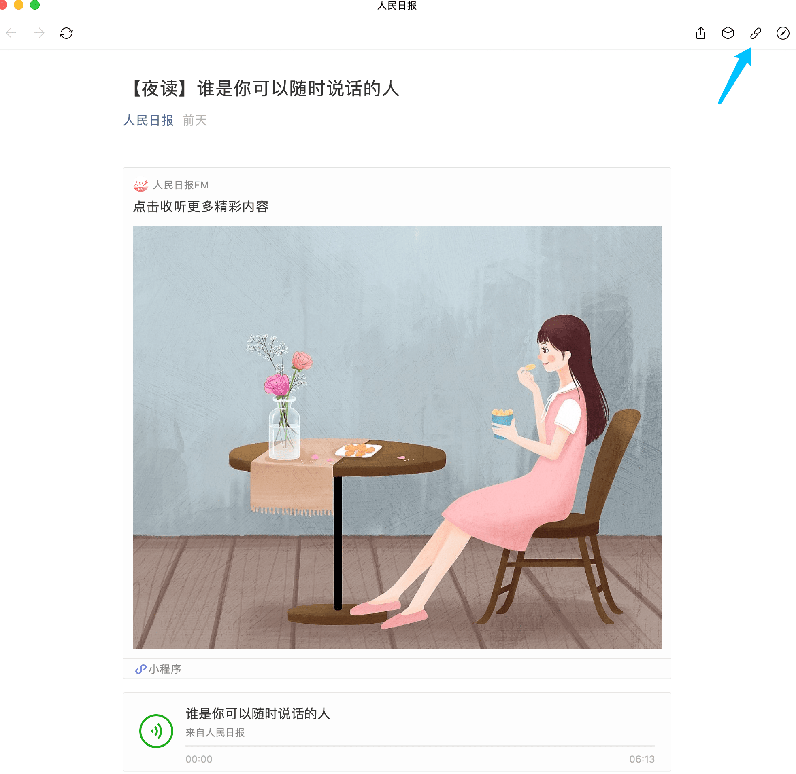
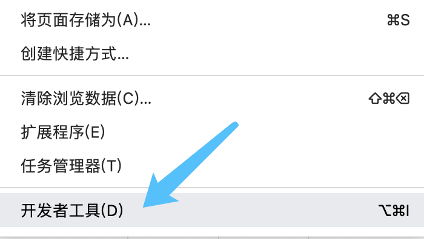
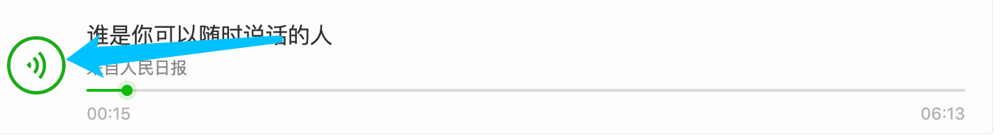
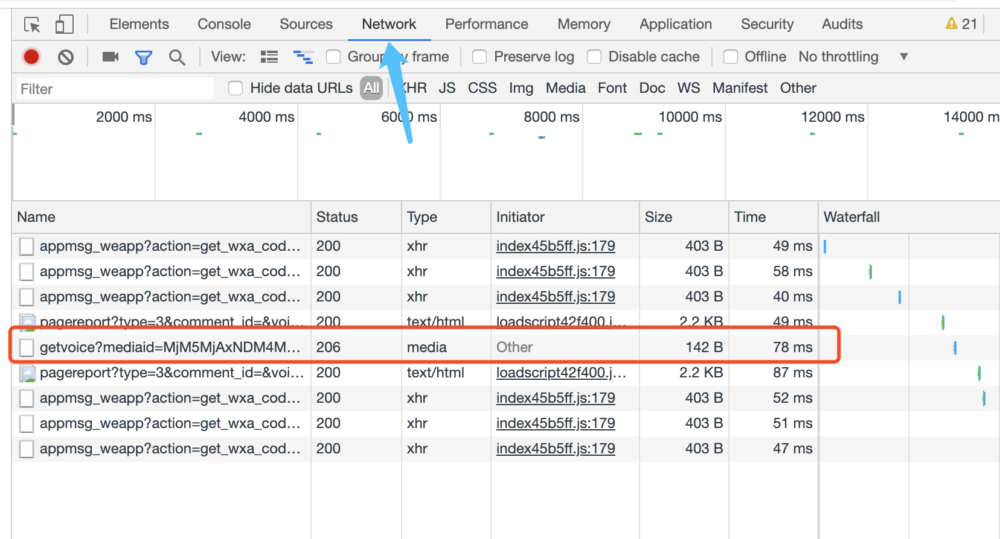
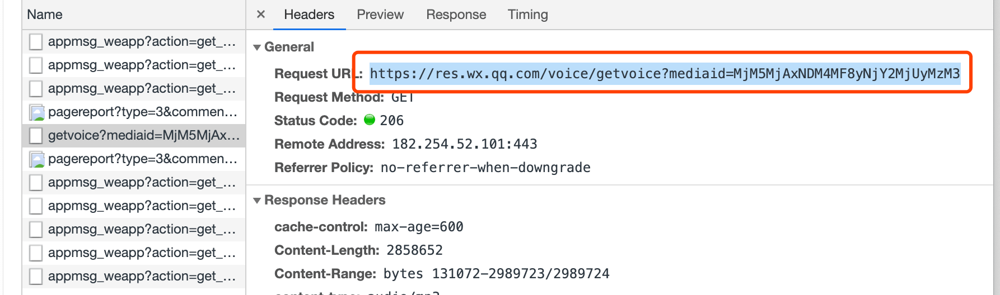
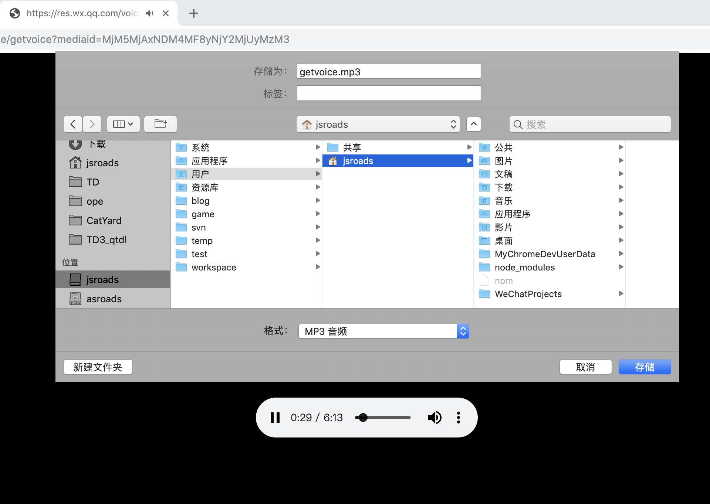
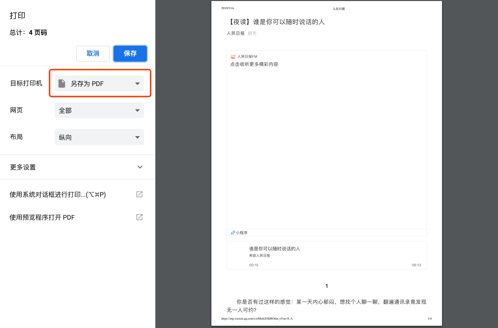
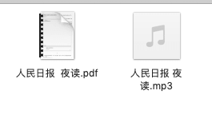

以前微信公众号是根据公众号为组 分发的，新的版本更新后，是根据内容时间分发的，这样对于很多知识干货的公众号，有时候会被信息内容过多，被沉下去，另外以前自己有时候公众号配有媒体文件，比如视频和音频，有时候我们想把这些内容保存到本地，在没有网络或者自己担心公众号突然一天不在了，依旧能够重新拜读，今天就说说如何把内容保存到本地。

<!-- more -->

### 具体步骤

1. 首先我们需要电脑端登陆微信，然后打开我们想保存的文章(带媒体的)

2. 我们复制链接地址在谷歌浏览器Chome里面打开

3. 打开浏览器的   更多设置— 开发者工具选项

   

4. 点击我们网页上面的 播放按钮

5. 然后查看右边的 Network 下面的媒体文件

6. 上面这个媒体文件就是我们要的音频文件

   

7. 复制这个链接 在新的窗口打开

8. 我们点击右键 保存到本地即可  音频文件保存成功！
9. 接下来我们 回到文章 点击右键 选择打印

保存为 PDF 格式即可

综上所述  我们已经成功将音频和视频保存到了本地,是不是很简单呢，当然了网上也有一些批量下载公众号的工具，也可以实现批量下载的功能。

