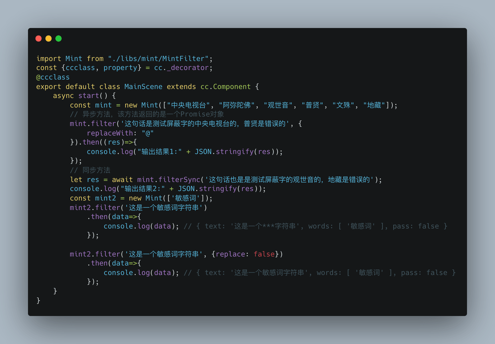
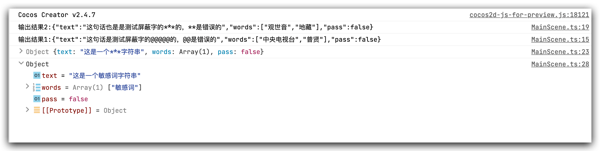
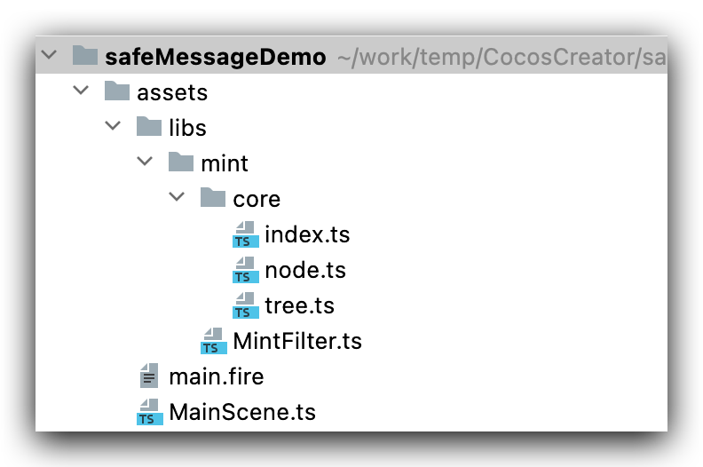

社交已经成为网络游戏的必配功能，最直接的社交莫过于聊天，社群聊天，经常会出现素质低的骂人，或者涉及ZF的惊天言论，为了净化聊天环境，于是乎一个功能产生了屏蔽过滤敏感词需求，程序员社区最好的就是开源精神，避免了后来的人重复造轮子，节省了工期，事半功倍也。闻道有先后，术业有专攻，站在巨人的肩膀上就可以望的更远，荀子曰：“君子生非异也，善假于物也。”下面介绍一个第三方库，如何在游戏内屏蔽敏感词功能的使用。
<!--more-->
我们先看看效果：





好了，看了结果，下面开始正文吧。

## 环境

### 电脑环境

- Mac 
- Cocos Creator 2.4.7

### 技术支持

- [mint-filter](https://github.com/ZhelinCheng/mint-filter)

类库介绍：掘金社区：[《TypeScript：Aho–Corasick算法实现敏感词过滤》](https://juejin.im/post/5cfa6bb6f265da1b8a4f0ed8)

## 类库介绍

先引用一段类库的介绍：

> 基于`Aho–Corasick`算法实现的敏感词过滤方案，`Aho–Corasick`算法是由Alfred V. Aho和Margaret J.Corasick 发明的字符串搜索算法，用于在输入的一串字符串中匹配有限组“字典”中的子串。它与普通字符串匹配的不同点在于同时与所有字典串进行匹配。算法均摊情况下具有近似于线性的时间复杂度，约为字符串的长度加所有匹配的数量。
>
> ### 性能
>
> 使用20000个随机敏感词实例化的平均时间：< 96ms
>
> 测试字符串包含随机生成的汉字、字母、数字。 以下测试均在20000个随机敏感词构建的树下进行测试，每组测试6次取平均值：
>
> | 编号 | 字符串长度 | 不替换敏感词[replace:false] | 替换敏感词 |
> | ---- | ---------- | --------------------------- | ---------- |
> | 1    | 1000       | < 1.35ms                    | < 1.55ms   |
> | 2    | 5000       | < 3.60ms                    | < 3.60ms   |
> | 3    | 10000      | < 8.10ms                    | < 9.81ms   |
> | 4    | 20000      | < 15.03ms                   | < 16.03ms  |
> | 5    | 50000      | < 20.83ms                   | < 21.18ms  |
> | 6    | 100000     | < 29.02ms                   | < 34.45ms  |
>
> 需要注意的是，实际生产环境运行速度会比上面测试数据更快。
>
> ## 使用
>
> ### CommonJS 引用
>
> ```
> // Mint导出是 export default Mint
> // 所以在使用require引用的时，Mint可能挂载在default下面
> const Mint = require('mint-filter').default
> const mint = new Mint(['敏感词数组'])
> 
> // 异步方法，该方法返回的是一个Promise对象
> mint.filter('word').then((res) => {})
> 
> // 同步方法
> mint.filterSync('word')
> ```
>
> ### TypeScript / ES Module引用
>
> ```
> import Mint from 'mint-filter'
> const mint = new Mint(['敏感词数组'])
> 
> // 异步方法，该方法返回的是一个Promise对象
> mint.filter('word').then((res) => {})
> 
> // 同步方法
> mint.filterSync('word')
> ```
>
> 

## Cocos Creator结合步骤

1. 首先我们用`Cocos Creator` 新建一个项目 叫做 `safeMessageDemo`。
2. 然后去`github` 上把 类库[mint-filter](https://github.com/ZhelinCheng/mint-filter)下载到本地。
3. 我们找到目录下的 `src` 文件夹结构如下 如果是`javascript` 项目 可以使用 `dist` 项目下的文件 这里选择 `typescript`使用。

```bash
/mint-filter-master/src
├── core
|  ├── index.ts
|  ├── node.ts
|  └── tree.ts
└── index.ts

directory: 1 file: 4
```

4. 把文件复制到新建的项目下  我这里修改 index.ts 为MintFilter.ts ，这个根据自己意愿即可。



5. 然后编写我们的测试代码，内容如下：

```typescript
/**
 * Created by jsroads on 2022/1/7  2:33 PM
 * Note:
 */
import Mint from "./libs/mint/MintFilter";
const {ccclass, property} = cc._decorator;
@ccclass
export default class MainScene extends cc.Component {
    async start() {
        const mint = new Mint(["中央电视台", "阿弥陀佛", "观世音", "普贤", "文殊", "地藏"]);
        // 异步方法，该方法返回的是一个Promise对象
        mint.filter('这句话是测试屏蔽字的中央电视台的，普贤是错误的', {
            replaceWith: "@"
        }).then((res)=>{
            console.log("输出结果1:" + JSON.stringify(res));
        });
        // 同步方法
        let res = await mint.filterSync('这句话也是是测试屏蔽字的观世音的，地藏是错误的');
        console.log("输出结果2:" + JSON.stringify(res));
        const mint2 = new Mint(['敏感词']);
        mint2.filter('这是一个敏感词字符串')
            .then(data=>{
                console.log(data); // { text: '这是一个***字符串', words: [ '敏感词' ], pass: false }
            });

        mint2.filter('这是一个敏感词字符串', {replace: false})
            .then(data=>{
                console.log(data); // { text: '这是一个敏感词字符串', words: [ '敏感词' ], pass: false }
            });
    }
}

```

6. 查看输出结果：


## 总结

这里只是做了一个搬运，没有什么技术难点，唯一要提醒的要注意引入路径，有的项目需要完整路径，特别是我重命名`index.ts`后 需要有完整路径才能正常引入。是如果是`js` 项目还要注意一下源码里面的 `require` 路径。

## 其他同类相关拓展

- [ToolGood.Words](https://github.com/toolgood/ToolGood.Words) 一款高性能非法词(敏感词)检测组件，附带繁体简体互换，支持全角半角互换，获取拼音首字母，获取拼音字母，拼音模糊搜索等功能。

## 参考

- 【作者博客】[TypeScript：Aho–Corasick算法实现敏感词过滤](https://zhelin.me/47627553bd09576fbdeafc11dc93bfbf/)
- 【掘金】[JavaScript：Aho–Corasick算法实现敏感词过滤](https://juejin.cn/post/6844903861493170189)