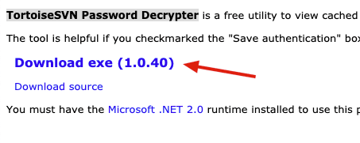
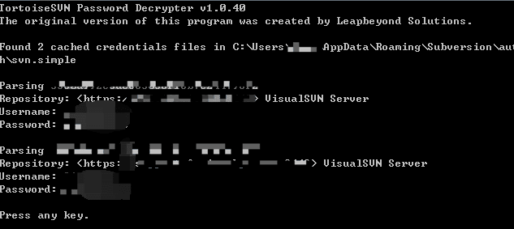

在公司的工作中，有时候项目开发要用到SVN开发，就会给个账号和密码，时间久了，忘记了，此时我们如何找回呢？且看下面细细道来。
<!--more-->

### 密码找回背景

刚开始做项目之前，就会需要添加一个SVN地址来download一个项目进行开发。Boss会给你一个账号名密码，就可以进行checkout了。过了一段时间可能就需要在checkout另一个项目了，就需要新建一个资源库地址，如果是同一个ip地址，那么是不需要再次输入账号名密码的，直接添加就可以了。可是如果不是同一个ip地址，那么需要再次录入账号名密码。如果有聊天记录，那就不需要往下看了，找到聊天记录就行。如果聊天记录没了，那怎么办呢。

### 步骤

####  首先,先找到你保存路径，默认是路径

```
C:\Users\Administrator\AppData\Roaming\Subversion\auth\svn.simple
```

#### 下载 TortoiseSVN Password Decrypter

[TortoiseSVN Password Decrypter](http://www.leapbeyond.com/ric/TSvnPD/)



#### 运行软件，查看密码



**此时，密码已经看到了！再次建议，最好还是自己写个文档专门存放和工作相关的账号密码。**

