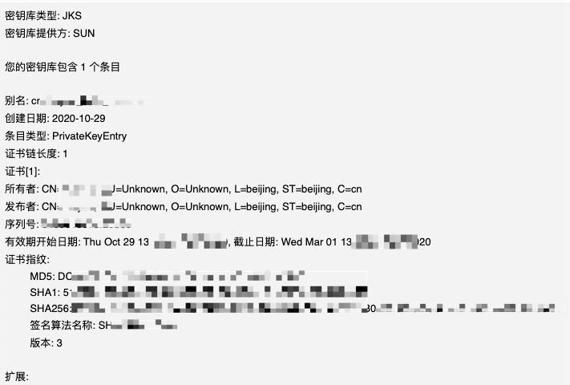
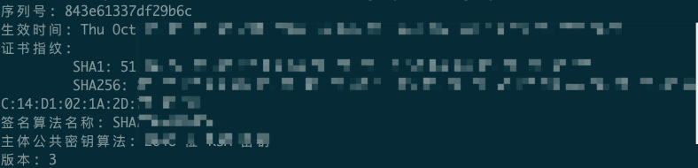

之前的文章内已经介绍了不少的关于Android环境下出Apk 包遇到的各种填坑操作，以及一些设置小技巧，但坑是未知的，今天又踩一个坑，这次的问题是和电脑环境有关的。于是下面记录一下。
<!--more-->

## 如何查看APK的MD5签名

正常来讲我们都知道，想查看APK 的MD5签名，一般是两种办法，一种是直接对我们的Android签名文件**keystore**操作，另外一种是对我们已经构建成功的Release包操作。

### 利用项目的 keystore （jks）文件

```bash
keytool -list -v -keystore  xxx.keystore
```

或者 （后缀不同而已）

```bash
 keytool -v -list -keystore xxx.jks
```

正常来讲 我们期待的结果是：



从输出的内容看到：`MD5: XXXXXXX` 就是我们要的签名内容。

### 通过CERT.RSA文件查询MD5签名

#### 解压构建的Apk得到RSA文件

 APK以zip文件方式打开，在\META-INF\目录中存在一个.RSA后缀的文件，一般名为CERT.RSA。

#### 使用keytool命令获取MD5签名

```bash
keytool -printcert -file CERT.RSA
```


## 意外情况无法显示MD5

### MD5不显示

无论是上面哪一种情况都是这样：只有SHA1和SHA256，看不到有MD5，此时我一度怀疑是不少我的签名文件生成的有问题。后面才知道原来和环境有关，后面让同事在他电脑上用同样的命令就显示成功了！




解决办法：网上先去搜索了是不是MD5 在高版本下，就被废弃什么的，无果，后面就搜了遇到的问题，还真有前人遇到和解决了，下面的评论也讨论了原因。文章链接：[jdk10.0.1使用keytool -v -list -keystore xxx.jks拿不到Md5值](https://blog.csdn.net/androidzmm/article/details/80814913)

摘抄评论：


### 查询知识

后面找从事`Android`相关的朋友帮忙询问得知原来：高版本java 移除了 这些  [Disable MD5 or MD2 signed jars](https://www.java.com/en/configure_crypto.html#disableMD5)

https://www.java.com/en/jre-jdk-cryptoroadmap.html

| 2017-04-18 | [8u131 b11](http://www.oracle.com/technetwork/java/javase/8u131-relnotes-3565278.html), [7u141 b11](http://www.oracle.com/technetwork/java/javaseproducts/documentation/javase7supportreleasenotes-1601161.html#R170_141), [6u151 b10](http://www.oracle.com/technetwork/java/javase/documentation/overview-156328.html#R160_151), [R28.3.14](https://docs.oracle.com/cd/E15289_01/JRRLN/newchanged.htm#GUID-64B46D62-4B59-42F8-831D-8D9A422F10E6) | MD5  | JAR files signed with MD5 algorithms are treated as unsigned JARs. | [Disabling MD5 signed jars](https://www.java.com/en/configure_crypto.html#disableMD5) | 2017-04-18 Released2016-12-08 Target date changed from 2017-01-17 to 2017-04-182016-10-24 Testing instructions added2016-09-30 Announced |
| ---------- | ------------------------------------------------------------ | ---- | ------------------------------------------------------------ | ------------------------------------------------------------ | ------------------------------------------------------------ |
|            |                                                              |      |                                                              |                                                              |                                                              |

好吧，于是输出了一下我的本地java环境：

```bash
smile@bogon ~ %  java -version
java version "15.0.1" 2020-10-20
Java(TM) SE Runtime Environment (build 15.0.1+9-18)
Java HotSpot(TM) 64-Bit Server VM (build 15.0.1+9-18, mixed mode, sharing)
smile@bogon ~ %
```

至此，一切真相终于浮出水面，扑所迷离的问题，终于弄明白啦。本文完毕了。

## 参考

- [jdk10.0.1使用keytool -v -list -keystore xxx.jks拿不到Md5值-CSDN](https://blog.csdn.net/androidzmm/article/details/80814913)
- [Mac Android显示SHA1和MD5值并生成签名文件打包APK-CSND](https://blog.csdn.net/csdn_aiyang/article/details/77991642)
- [如何查看APK的MD5签名-简书](https://www.jianshu.com/p/76c566e57eb3)

