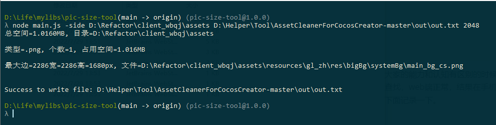

项目大了之后，很多时候都是多个部门用一个项目，更新资源代码，大家的能力和认知有区别的时候，导致有时候美术提交了不合尺寸的图片，前端使用的同事也粗心大意没有第二次查找，web端正常，结果在手机上就导致报错，如何查找图片的尺寸和物理内存大小呢，于是写了个查找工具，下面记录一下。
<!--more-->

在项目 根目录 运行 ：下面代表 找出其中最大边 大于 2048的 图片先看看效果：

```bash
node main.js -side D:\Refactor\client_wbqj\assets D:\Helper\Tool\AssetCleanerForCocosCreator-master\out\out.txt 2048
```



## 环境

- nodejs
- [image-size](https://www.npmjs.com/package/image-size)
- Windows10

### 核心代码

main.js

```javascript
/*
* Usage:
* node main.js -size d:\myproject\assets d:\out.txt
*/
const AssetBytesSize = require('./AssetBytesSize');
const AssetWHSize = require('./AssetWHSize');
const command = process.argv[2];
const sourceFile = process.argv[3];
const destFile = process.argv[4];
const compareSize = process.argv[5];
global._delete = process.argv.includes('-d') || process.argv.includes('-delete') // 删除未引用的资源
global._excludes = process.argv.filter(n => n.includes('-e=') || n.includes('-excludes=')).map(node => { // 删除未引用的资源时，需要排除的文件或路径，支持字符串或正则
    let _i = node.replace('-e=', '')
    if (_i !== node) return _i
    _i = node.replace('-excludes=', '')
    if (_i !== node) return _i
    return ''
})[0]
let Version = 'PicHelper 1.0';
let parseCommand = function (cmd) {
    if (!cmd || cmd.length <= 0) {
        console.error('main: command is invalid');
        return;
    }
    switch (cmd) {
        case '-size':
            AssetBytesSize.start(sourceFile, destFile);
            break;
        case '-side':
            AssetWHSize.start(sourceFile, destFile, compareSize || 0);
            break;
        default:
            let strHelp = Version + '\n' +
                'Usage: node main.js <command>\n' +
                'Examples:\n' +
                '  node main.js -side d:/myproject/assets d:/out.txt\n' +
                '  node main.js -size d:/myproject/assets d:/out.txt';
            console.log(strHelp);
            break;
    }
};

parseCommand(command);
```

Utils.js

```javascript
let Utils = {
    // 字节数转换为MB
    byte2Mb(byte) {
        return byte / (1024 * 1024);
    },
    // 字节数转换为按MB表示的字符串，保留小数点后4位
    byte2MbStr(byte) {
        return this.byte2Mb(byte).toFixed(4);
    },
    // 字节数转换为KB
    byte2Kb(byte) {
        return byte / 1024;
    },
    // 字节数转换为按KB表示的字符串，保留小数点后2位
    byte2KbStr(byte) {
        return this.byte2Kb(byte).toFixed(2);
    },
};
module.exports = Utils;
```

FileHelper.js

```javascript
const fs = require('fs');
const path = require('path');
const sizeOf = require('image-size');
let FileHelper = {
    // 返回图片尺寸
    getImageWH(filePath, ext) {
        let dimensions = {width:0,height:0,max:0};
        if ('.png' === ext || '.jpg' === ext || '.webp' === ext) {
            let fileSize = sizeOf(filePath);
            dimensions.width = fileSize.width;
            dimensions.height = fileSize.height;
            dimensions.max  =  Math.max(dimensions.width,dimensions.height);
        }
        return dimensions;
    },

    // 返回图片占用内存(width*height*4)
    getImageMem(filePath, ext) {
        let memBytes = 0;
        // if ('.png' === ext || '.jpg' === ext || '.webp' === ext) {
        //     memBytes = images(filePath).width() * images(filePath).height() * 4;
        // }
        return memBytes;
    },

    getFullPath(filePath) {
        if (!path.isAbsolute(filePath)) {
            filePath = path.join(__dirname, filePath); // 非绝对路径则加上当前目录
        }
        return filePath;
    },
    
    // 输出到文件
    writeFile(fullPath, content) {
        if (!fullPath || !content) {
            console.error('writeFile: invalid params');
            return;
        }

        fs.writeFile(fullPath, content, (err) => {
            if (err) {
                console.error(err);
                return;
            }
            console.log(content);
            console.log('Success to write file: ' + fullPath);
        });
    },

    // 返回文件内容的json对象
    getObjectFromFile(fullPath) {
        let retObj = {};
        if (!fs.existsSync(fullPath)) {
            console.error('getObjectFromFile: NoExist path=' +fullPath);
            return retObj;
        }
        let str = this.getFileString(fullPath);
        if (!str) {
            console.error('getObjectFromFile: invalid file=' +fullPath);
            return retObj;   
        }
        retObj = JSON.parse(str);
        if (!retObj) {
            console.error('getObjectFromFile: invalid object=' +fullPath);
            return retObj;
        }
        return retObj;
    },

    // 返回文件内容的字符串形式
    getFileString(fullPath) {
        return fs.readFileSync(fullPath).toString();
    },
    // 函数防抖
    debounce(fn, wait = 1000) {
        var timeout = null;
        return function() {
            timeout && clearTimeout(timeout);
            timeout = setTimeout(fn, wait);
        }
    }
};
module.exports = FileHelper;
```

AssetBytesSize.js

```javascript
const fs = require('fs');
const path = require('path');
const FileHelper = require('./FileHelper');
const Utils = require('./Utils');

let AssetBytesSize = {
    fileMap: null,

    start(sourceFile, destFile) {
        if (!sourceFile || sourceFile.length <= 0 || !destFile || destFile.length <= 0) {
            console.error('Cleaner: invalid source or dest');
            return;
        }

        this.fileMap = new Map();

        sourceFile = FileHelper.getFullPath(sourceFile);
        destFile = FileHelper.getFullPath(destFile);

        this.lookupAssetDir(sourceFile, null);
        let outStr = this.getSortedResult(this.fileMap, sourceFile);
        FileHelper.writeFile(destFile, outStr);
    },

    // 遍历文件夹
    lookupAssetDir(srcDir, callback) {
        if (!srcDir || !fs.existsSync(srcDir)) {
            console.error("AssetBytesSize: invalid srcDir=" +srcDir);
            return;
        }

        let files = fs.readdirSync(srcDir);
        for (let i = 0, len = files.length; i < len; i++) {
            let file = files[i];
            let curPath = path.join(srcDir, file);
            let stats = fs.statSync(curPath);

            if (stats.isDirectory()) {
                this.lookupAssetDir(curPath);
                continue;
            }

            let pathObj = path.parse(curPath);
            let value = this.fileMap.get(pathObj.ext);
            if (!value) {
                value = new Map();
                this.fileMap.set(pathObj.ext, value);
            }
            let memBytes = FileHelper.getImageMem(curPath, pathObj.ext);
            value.set(curPath, { path:curPath, size:stats.size, memBytes });
        }
    },

    getSortedResult(fileMap, srcDir) {
        let allTypes = [];
        
        fileMap.forEach((files, ext) => {
            let { totalSize, totalMem, outStr } = this.formatByByte(files);
            allTypes.push({ size:parseFloat(totalSize), mem:parseFloat(totalMem), ext, count:files.size, outStr });
        });
        
        allTypes.sort(function(a, b) {
            return b.size - a.size;
        });

        let content = '';
        let allSize = 0;

        // 输出汇总
        for (let i = 0, len = allTypes.length; i < len; i++) {
            let data = allTypes[i];
            content += '类型=' + data.ext + ', 个数=' + data.count + ', 占用空间=' + data.size + 'MB';
            if (data.mem > 0) {
                content += ', 预计内存=' + data.mem + 'MB';
            }
            content += '\n';
            allSize += data.size;
        }

        let totalStr = '总空间=' + allSize.toFixed(4) + 'MB, ' + '目录=' + srcDir + '\n\n';
        totalStr += content + '\n';

        // 输出分类型信息
        for (let i = 0, len = allTypes.length; i < len; i++) {
            let data = allTypes[i];
            totalStr += data.outStr + '\n';
        }
        
        return totalStr;
    },

    // 格式化为从大到小按MB表示
    formatByByte(files) {
        let totalSize = 0;
        let totalMem = 0;
        let newFiles = [];

        files.forEach(function(file, path) {
            totalSize += file.size;
            totalMem += file.memBytes;
            newFiles.push(file);
        });

        // 按占用空间从大到小排序
        newFiles.sort(function(a, b) {
            return b.size - a.size;
        });

        let outStr = '';
        for (let i = 0, len = newFiles.length; i < len; i++) {
            let file = newFiles[i];
            outStr += '空间=' + Utils.byte2KbStr(file.size) + 'KB, 文件=' + file.path;
            if (file.memBytes > 0) {
                outStr += ', 内存=' + Utils.byte2MbStr(file.memBytes) + 'MB';
            }
            outStr += '\n';
        }

        totalSize = Utils.byte2MbStr(totalSize);
        totalMem = Utils.byte2MbStr(totalMem);
        return { totalSize, totalMem, outStr };
    },

};

module.exports = AssetBytesSize;
```

AssetWHSize.js

```javascript
const fs = require('fs');
const path = require('path');
const FileHelper = require('./FileHelper');
const Utils = require('./Utils');

let compareSize  = 0;

let AssetWHSize = {
    fileMap: null,

    start(sourceFile, destFile,size) {
        if (!sourceFile || sourceFile.length <= 0 || !destFile || destFile.length <= 0) {
            console.error('Cleaner: invalid source or dest');
            return;
        }
        compareSize = size;
        this.fileMap = new Map();

        sourceFile = FileHelper.getFullPath(sourceFile);
        destFile = FileHelper.getFullPath(destFile);

        this.lookupAssetDir(sourceFile, null);
        let outStr = this.getSortedResult(this.fileMap, sourceFile);
        FileHelper.writeFile(destFile, outStr);
    },

    // 遍历文件夹
    lookupAssetDir(srcDir, callback) {
        if (!srcDir || !fs.existsSync(srcDir)) {
            console.error("AssetWHSize: invalid srcDir=" + srcDir);
            return;
        }

        let files = fs.readdirSync(srcDir);
        for (let i = 0, len = files.length; i < len; i++) {
            let file = files[i];
            let curPath = path.join(srcDir, file);
            let stats = fs.statSync(curPath);

            if (stats.isDirectory()) {
                this.lookupAssetDir(curPath);
                continue;
            }

            let pathObj = path.parse(curPath);
            let value = this.fileMap.get(pathObj.ext);
            if (!value) {
                value = new Map();
                this.fileMap.set(pathObj.ext, value);
            }
            if ([".png", ".jpg", ".webp"].includes(pathObj.ext)) {
                let dimensions = FileHelper.getImageWH(curPath, pathObj.ext);
                // console.log(JSON.stringify(dimensions))
                if(dimensions.max>compareSize){
                    value.set(curPath, {path: curPath, size: stats.size, dimensions, max: dimensions.max});
                }

            }
        }
    },

    getSortedResult(fileMap, srcDir) {
        let allTypes = [];

        fileMap.forEach((files, ext) => {
            let {totalSize, outStr} = this.formatByByte(files);
            allTypes.push({size: parseFloat(totalSize), ext, count: files.size, outStr});
        });

        allTypes.sort(function (a, b) {
            return b.size - a.size;
        });

        let content = '';
        let allSize = 0;

        allTypes = allTypes.filter((value)=>{
            return value.count>0
        })
        // 输出汇总
        for (let i = 0, len = allTypes.length; i < len; i++) {
            let data = allTypes[i];
            content += '类型=' + data.ext + ', 个数=' + data.count + ', 占用空间=' + data.size + 'MB';
            if (data.max > 0) {
                content += ', 宽度=' + data.width + 'px' + ', 高度=' + data.height + 'px';
            }
            content += '\n';
            allSize += data.size;
        }

        let totalStr = '总空间=' + allSize.toFixed(4) + 'MB, ' + '目录=' + srcDir + '\n\n';
        totalStr += content + '\n';

        // 输出分类型信息
        for (let i = 0, len = allTypes.length; i < len; i++) {
            let data = allTypes[i];
            totalStr += data.outStr + '\n';
        }

        return totalStr;
    },

    // 格式化为从大到小按MB表示
    formatByByte(files) {
        let totalSize = 0;
        let newFiles = [];
        files.forEach(function (file, path) {
            totalSize += file.size;
            newFiles.push(file);
        });
        // 按占用空间从大到小排序
        newFiles.sort(function (a, b) {
            return b.max - a.max;
        });

        let outStr = '';
        for (let i = 0, len = newFiles.length; i < len; i++) {
            let file = newFiles[i];
            outStr += '最大边=' + file.dimensions.max + '宽=' + file.dimensions.width + '高=' + file.dimensions.height + 'px, 文件=' + file.path;
            outStr += '\n';
        }
        totalSize = Utils.byte2MbStr(totalSize);
        return {totalSize, outStr};
    },

};

module.exports = AssetWHSize;
```

## 注意事项

- 需要添加 [image-size](https://www.npmjs.com/package/image-size) 依赖 

```bash
npm install image-size
```

最后源码地址 [点击前往](https://github.com/jsroads/mylibs/tree/main/pic-size-tool)

## 参考

- [AssetCleanerForCocosCreator](https://github.com/foupwang/AssetCleanerForCocosCreator)