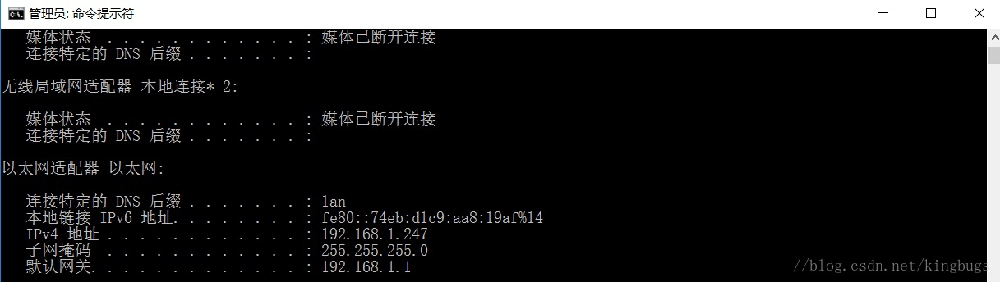
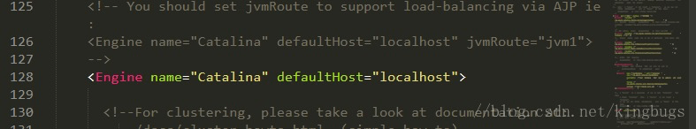
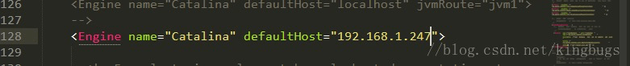

学习javaWeb已经一个星期了，已经可以制作一些简单的网站，这时候突然想着让自己在Tomcat上部署项目让宿舍同在一个局域网中的小伙伴访问以下，让他们看看我的学习成果。刚开始搞了半天，他们就是没有办法访问，在网上查了一些之后，用以下的方法可以解决。

<!-- more -->

**1.先查到自己电脑在局域网中的IP地址：**

    在控制台下使用ipconfig查询：

 得到了自己的IP是192.168.1.247.

打开自己的Tomcat服务器的server.xml

将<Engine name="Catalina" defaultHost="localhost">中的defaultHost="localHost"改成自己的IP地址

这里我将我自己的填上：

这样会在Tomcat启动后，会在work文件夹下创建一个以IP地址为目录的文件夹。

然后接着修改

将name="localhost"改成name="自己的ip"

再起启动Tomcat，同在一个局域网中的小伙伴通过ip地址和端口便可以顺利访问都自己的项目。