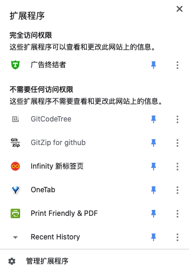
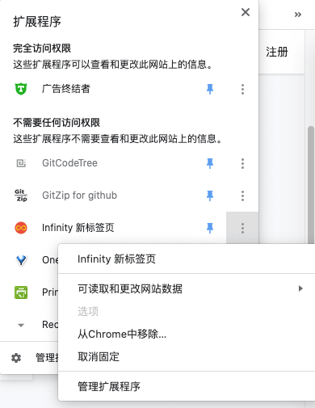
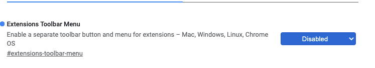

谷歌Chrome浏览器是网站开发者必备的测试软件，不仅如此，很多用户也喜欢使用Chrome浏览器，因为它的简洁、稳定快速等优势。当前正式版本的谷歌Chrome浏览器的扩展程序被放在三级菜单，使用起来非常不方便。但是这样我们在最小窗口下只能显示一个拓展，我一般使用自己最常用的两个展示，要隐藏这个菜单按钮。下面就简单的介绍一下。

<!--more-->

### 扩展管理菜单介绍

谷歌Chrome正在测试工具栏扩展菜单：新增一个扩展管理按钮，点击即可显示已安装的扩展程序。

点击扩展程序列表右侧的三个小点（选项菜单），弹出设置菜单，代替右击扩展程序图标功能，更加直观。如果不想在标题栏显示，可以选择“取消固定”，扩展程序就会在地址栏消失，大大节省了地址栏的空间。新的扩展程序菜单还包括“管理扩展程序”选项，可快速进入扩展程序管理页面。

新版菜单把“扩展程序管理”从“更多工具”里移出，放在扩展程序专属的菜单中，操作更加方便

### 如何启用Google Chrome的新扩展程序菜单？

请在Chrome的多功能框中键入“chrome：// flags”，也称为地址栏，然后按Enter键。

1. 搜索“Extensions Toolbar Menu”并选择开启，即可启用。
2.  使用此处的搜索框搜索“扩展程序工具栏”。 您也可以将此文本复制粘贴到Chrome的多功能框中，然后按Enter： `chrome://flags/#extensions-toolbar-menu`

点击“扩展程序工具栏菜单”选项右侧的框，然后选择“已启用”。

**相反，我是因为浏览器默认启用了这个，我需要自己关闭这个，选择 “disabled” 即可**

